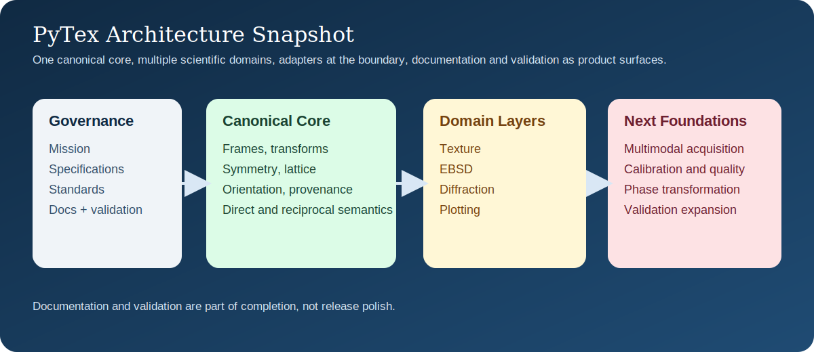

# PyTex

PyTex is a GPL-compatible, pure-Python-first library for crystallographic texture and diffraction
with a deliberate focus on materials-science research and teaching.

The repository is being built around four non-negotiable foundations:

- a canonical crystallographic data model for frames, symmetry, orientations, maps, structure, and
  diffraction geometry
- first-class semantic batch support for vectorized operations on vectors, Euler angles,
  quaternions, rotations, and orientations
- hybrid scientific documentation: Sphinx for the primary browsable and searchable docs surface,
  LaTeX for authoritative scientific notes, and SVG for canonical figures
- MTEX-plus validation, where MTEX parity is the baseline and PyTex-specific interoperability and
  provenance checks extend beyond it
- explicit reference canon governance, so conventions are fixed from authoritative sources and not
  re-litigated locally

## Start Here

- `mission.md`
- `specifications.md`
- `AGENTS.md`
- `docs/README.md`
- `docs/architecture/overview.md`
- `docs/architecture/canonical_data_model.md`
- `docs/testing/strategy.md`
- `docs/testing/mtex_parity_matrix.md`
- `docs/testing/diffraction_validation_matrix.md`
- `docs/roadmap/implementation_roadmap.md`
- `docs/standards/notation_and_conventions.md`
- `docs/standards/latex_and_figures.md`
- `docs/standards/documentation_architecture.md`
- `docs/standards/scientific_citation_policy.md`
- `docs/standards/benchmark_and_tolerance_governance.md`
- `docs/standards/hexagonal_and_trigonal_conventions.md`
- `docs/standards/development_principles.md`
- `docs/standards/data_contracts_and_manifests.md`
- `docs/standards/reference_canon.md`

## Current Status

The repository is now best described as a strong foundation build rather than a pure scaffold:

- modern Python packaging and CI skeleton
- canonical core data structures under `src/pytex/`
- semantic batch primitives for high-volume vectorized operations without dropping frame or
  convention meaning
- multimodal acquisition primitives for shared geometry, calibration, quality, and scattering
  semantics
- stable manifest families for import, experiment, benchmark, validation, and workflow-result
  interchange
- transformation primitives for orientation relationships, variants, and phase-transformation
  records
- documentation governance and hybrid scientific doc scaffold
- validation strategy and explicit ledgers for texture, EBSD, and diffraction posture
- baseline tests for the foundational data model
- symmetry-aware orientation and disorientation foundations
- PF/IPF containers, class-specific IPF sector reduction, discrete kernel-based ODF foundations,
  and classical contour or section plotting surfaces
- regular-grid EBSD neighborhood, KAM, grain segmentation, GROD, grain-boundary, cleanup, and
  import-manifest workflow foundations
- diffraction geometry, reciprocal-space primitives, powder XRD generation, SAED spot generation,
  reflection-family grouping, and local indexing candidate scaffolding
- runtime scientific plotting for texture, diffraction, and structure, including YAML-driven styles
  and VESTA-like 3D crystal viewing
- a hash-pinned phase-fixture corpus with manifest-backed structure-import audit coverage
- first open-source external-baseline cases for powder XRD and SAED using pinned in-repo artifacts
- deterministic SVG visual regression coverage for XRD, SAED, crystal scenes, and IPF plotting
- smoke-executed priority notebooks for the immediate fixture-to-visualization-to-diffraction
  teaching path

Exact orientation-space polyhedra, harmonic ODF inversion, richer external validation, broader
multimodal workflow depth, and transformation algorithms are intentionally staged after the current
build so they do not invent conflicting conventions.

## Quick Start

Install the package in editable mode with development tools. This standard contributor bootstrap
includes the CIF-backed structure-import support exercised by the normal test suite:

```bash
python -m pip install -e '.[dev]'
python scripts/check_repo_integrity.py
ruff check .
mypy src
pytest
```

Inspect the documentation inventory from the CLI:

```bash
python -m pytex info
python -m pytex docs inventory
python -m pytex core demo
```

For full install, notebook, Sphinx, and PDF build guidance on Windows, macOS, and Linux, see
`docs/site/tutorials/installation_and_build.md`.

## Repository Layout

```text
pytex/
+-- src/pytex/
|   +-- core/
|   +-- texture/
|   +-- ebsd/
|   +-- diffraction/
|   +-- adapters/
|   +-- plotting/
|   `-- experimental/
+-- tests/
+-- docs/
|   +-- architecture/
|   +-- testing/
|   +-- roadmap/
|   +-- standards/
|   +-- development/
|   +-- site/
|   +-- tex/
|   `-- figures/
+-- fixtures/
+-- benchmarks/
+-- schemas/
+-- examples/
`-- scripts/
```

## Design Direction

- Own the domain model instead of leaking raw arrays through public APIs where frame or symmetry
  meaning would be ambiguous.
- Treat vectorized scientific workloads as first-class and keep shared frame or convention meaning
  attached through semantic batch primitives.
- Reuse proven projects such as ORIX, KikuchiPy, PyEBSDIndex, pymatgen, and diffsims through
  adapters instead of coupling the whole library to any single external representation.
- Treat documentation, figures, and validation artifacts as product deliverables rather than
  release polish.
- Keep research-grade depth and teaching-grade clarity in the same repository.
- Broaden the foundations deliberately toward multimodal materials characterization without
  weakening the texture-led semantic core.
- Keep plotting, style policy, and export behavior explicit: runtime user plots are ordinary
  Matplotlib figures, while repository-tracked canonical documentation figures remain SVG assets.

## Current Hardening Priorities

- Keep README, roadmap, CI, manifests, and validation ledgers synchronized with the actual
  repository state.
- Broaden the current first-wave structure-import and diffraction baselines into larger
  literature-backed programs without weakening the pinned in-repo reproducibility path.
- Preserve the current core-model clarity while expanding multimodal workflow depth and
  transformation algorithms on top of the new validated foundations.

## Architecture Snapshot



## License

PyTex is released under the GPL-3.0-or-later license. See `LICENSE` for the repository license
notice. The licensing posture is intentional so GPL-compatible scientific dependencies can be
integrated cleanly where that makes technical sense.
