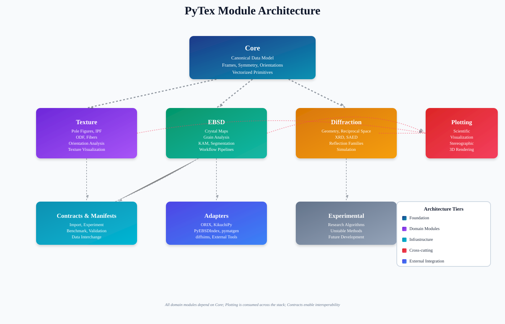
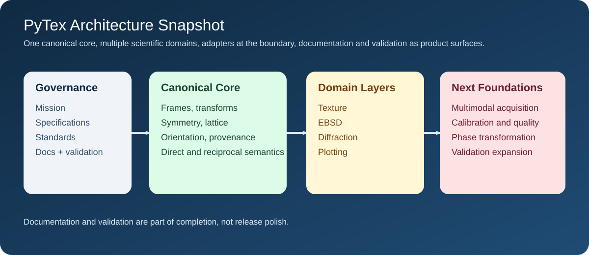

# PyTex

PyTex is a GPL-compatible, pure-Python-first library for crystallographic texture and diffraction
with a deliberate focus on materials-science research and teaching.

## Standalone and portal integration

PyTex remains independently deployable as its own desktop and intranet web workbench. The Office
Scientific Tools portal is an optional gateway integration for shared discovery; it must not be a
dependency of PyTex development, testing, standalone web deployment, or desktop use.

The repository is being built around four non-negotiable foundations:

- a canonical crystallographic data model for frames, symmetry, orientations, maps, structure, and
  diffraction geometry
- first-class semantic batch support for vectorized operations on vectors, Euler angles,
  quaternions, rotations, and orientations
- layered scientific documentation: one Sphinx site carrying concepts, workflows, and the
  authoritative theory notes with their mathematics rendered, plus SVG for canonical figures
- MTEX-plus validation, where MTEX parity is the baseline and PyTex-specific interoperability and
  provenance checks extend beyond it
- explicit reference canon governance, so conventions are fixed from authoritative sources and not
  re-litigated locally

## Architecture Overview



The PyTex library is organized into complementary, layered modules:

- **Core**: The foundational canonical data model supporting frames, symmetry, orientations, and vectorized primitives
- **Domain Modules** (Texture, EBSD, Diffraction): Specialized semantic operations built on Core
- **Plotting**: Cross-cutting visualization layer supporting scientific figures, stereographic plots, and 3D crystal rendering
- **Infrastructure** (Contracts & Manifests): Machine-readable schemas for reproducible data interchange
- **Adapters**: Optional bridges to ORIX, KikuchiPy, PyEBSDIndex, pymatgen, and other tools
- **Experimental**: Research-stage algorithms and unstable methods staged for future stabilization

## Start Here

**Core Project Documentation**
- [mission.md](mission.md) — Project mission and long-term vision
- [specifications.md](specifications.md) — Technical specifications and requirements
- [AGENTS.md](AGENTS.md) — Automation and contribution guidelines

**Architecture & Design**
- [docs/README.md](docs/README.md) — Documentation overview and site structure
- [docs/architecture/overview.md](docs/architecture/overview.md) — High-level architecture
- [docs/architecture/canonical_data_model.md](docs/architecture/canonical_data_model.md) — Core data model

**Testing & Validation**
- [docs/testing/strategy.md](docs/testing/strategy.md) — Testing strategy and approach
- [docs/testing/mtex_parity_matrix.md](docs/testing/mtex_parity_matrix.md) — MTEX parity validation
- [docs/testing/diffraction_validation_matrix.md](docs/testing/diffraction_validation_matrix.md) — Diffraction validation

**Roadmap & Standards**
- [docs/roadmap/implementation_roadmap.md](docs/roadmap/implementation_roadmap.md) — Implementation roadmap
- [docs/standards/notation_and_conventions.md](docs/standards/notation_and_conventions.md) — Notation and conventions
- [docs/standards/scientific_notes_and_figures.md](docs/standards/scientific_notes_and_figures.md) — Scientific-note and figure standards
- [docs/standards/documentation_architecture.md](docs/standards/documentation_architecture.md) — Documentation architecture
- [docs/standards/scientific_citation_policy.md](docs/standards/scientific_citation_policy.md) — Citation policy
- [docs/standards/benchmark_and_tolerance_governance.md](docs/standards/benchmark_and_tolerance_governance.md) — Benchmark governance
- [docs/standards/hexagonal_and_trigonal_conventions.md](docs/standards/hexagonal_and_trigonal_conventions.md) — Hexagonal/trigonal conventions
- [docs/standards/development_principles.md](docs/standards/development_principles.md) — Development principles
- [docs/standards/data_contracts_and_manifests.md](docs/standards/data_contracts_and_manifests.md) — Data contracts
- [docs/standards/reference_canon.md](docs/standards/reference_canon.md) — Reference canon

## Current Status

**Version 0.3.0**, a Workbench feature release: crystal-structure import from `.cif` wherever a
phase is chosen, an ECCI two-beam tilt solver for the SEM stage, and an explicit
double-diffraction control on the SAED simulator. See [CHANGELOG.md](CHANGELOG.md) for the
release notes and every scientific behaviour change stated explicitly — including the one
capability that changes what a simulated pattern contains, which is off by default.

PyTex is a validated foundation with substantial scientific breadth on top of it, plus an
application. What exists today:

**The canonical model.** Frames, symmetry, lattices and phases, orientations and their
representations — including the equal-volume homochoric and cubochoric maps — with semantic batch
primitives so a million orientations keep their frame and convention meaning.

**Texture.** Pole figures, inverse pole figures and the discrete kernel ODF; harmonic ODF
reconstruction and the ghost problem it runs into; pole-figure arithmetic on the m.r.d. scale;
XRDML import with random-standard defocusing calibration; named components, fibres, and the Kearns
parameter.

**EBSD.** Square and staggered-hexagonal grids, KAM, grain segmentation, GROD, boundaries and
cleanup, GND density, multiphase topology graphs, and readers for `.ang`, `.ctf` and OIM HDF5
(`.oh5`/`.h5`).

**Diffraction.** Powder XRD with profiles, preferred orientation and measured-profile comparison;
SAED simulation and ratio/angle indexing of a measured pattern; Kikuchi bands and the gnomonic
projection, stereographic Kikuchi maps with zone-axis routing, and the EBSD camera geometry;
convergent-beam diffraction, including the dynamical many-beam treatment and diffraction-group
point-group determination.

**Transformation crystallography.** Orientation relationships with variants, packets and
intervariant spectra; lattice correspondence and transformation strain; OR identification from
measured orientations and parent-grain reconstruction, which remains experimental at map scale.

**The workbench.** One codebase behind a desktop shell and an intranet server: seven workspaces
holding sixteen panels, every one generated from a self-describing operation manifest and shipping
runnable examples the test suite executes. See
[the user guide](docs/site/workflows/workbench_application.md).

**The documentation.** A Sphinx site carrying concepts, workflows, theory notes with their
mathematics rendered, thirty-one executable tutorial notebooks, and a gallery of worked examples
whose numbers are computed at build time and checked against cited reference values.

Habit-plane and phenomenological-theory work, broader external validation against MTEX, and
out-of-core map handling are deliberately staged rather than started, so they do not invent
conflicting conventions before the surfaces they would rest on are settled.

## Quick Start

PyTex now uses two documented contributor lanes:

- `base lane`: core development, docs, integrity, and the default test suite
- `full scientific lane`: base lane plus optional scientific adapters such as `pymatgen`, ORIX, KikuchiPy, and diffsims

Install the base lane in editable mode with development tools:

```bash
python -m pip install -e '.[dev,docs]'
python scripts/check_repo_integrity.py
python -m ruff check .
python -m mypy src
python -m pytest -q
python scripts/check_sphinx_warnings.py --max-warnings 602
```

Install the full scientific lane when you need the CIF-backed structure-import path and the
optional interoperability coverage exercised by the heavier validation surfaces:

```bash
python -m pip install -e '.[dev,docs,adapters]'
python -m pytest -q -rs
```

Inspect the documentation inventory from the CLI:

```bash
python -m pytex info
python -m pytex docs inventory
python -m pytex core demo
```

For full install, notebook, Sphinx, and PDF build guidance on Windows, macOS, and Linux, see
`docs/site/tutorials/installation_and_build.md`.

## Repository Layout

```text
pytex/
+-- src/pytex/
|   +-- core/
|   +-- texture/
|   +-- ebsd/
|   +-- diffraction/
|   +-- adapters/
|   +-- plotting/
|   `-- experimental/
+-- tests/
+-- docs/
|   +-- architecture/
|   +-- testing/
|   +-- roadmap/
|   +-- standards/
|   +-- development/
|   +-- site/
|   +-- tex/
|   `-- figures/
+-- fixtures/
+-- benchmarks/
+-- schemas/
+-- examples/
`-- scripts/
```

## Design Direction

- Own the domain model instead of leaking raw arrays through public APIs where frame or symmetry
  meaning would be ambiguous.
- Treat vectorized scientific workloads as first-class and keep shared frame or convention meaning
  attached through semantic batch primitives.
- Reuse proven projects such as ORIX, KikuchiPy, PyEBSDIndex, pymatgen, and diffsims through
  adapters instead of coupling the whole library to any single external representation.
- Treat documentation, figures, and validation artifacts as product deliverables rather than
  release polish.
- Keep research-grade depth and teaching-grade clarity in the same repository.
- Broaden the foundations deliberately toward multimodal materials characterization without
  weakening the texture-led semantic core.
- Keep plotting, style policy, and export behavior explicit: runtime user plots are ordinary
  Matplotlib figures, while repository-tracked canonical documentation figures remain SVG assets.

## Current Hardening Priorities

- Keep README, roadmap, CI, manifests, and validation ledgers synchronized with the actual
  repository state.
- Maintain one explicit base lane and one explicit full scientific lane so optional-dependency
  expectations are executable rather than implicit.
- Broaden the current first-wave structure-import, diffraction, and transformation validation
  programs without weakening the pinned in-repo reproducibility path.
- Preserve the current core-model clarity while raising MTEX-foundational coverage in orientation,
  Miller, and harmonic reconstruction surfaces before broad new feature work.

## Architecture Snapshot



## License

PyTex is released under the GPL-3.0-or-later license. See `LICENSE` for the repository license
notice. The licensing posture is intentional so GPL-compatible scientific dependencies can be
integrated cleanly where that makes technical sense.
