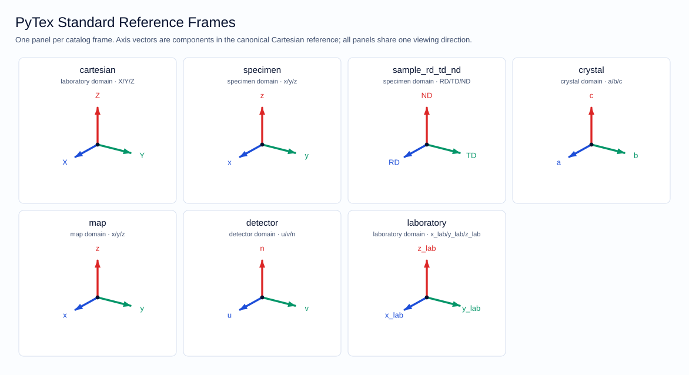
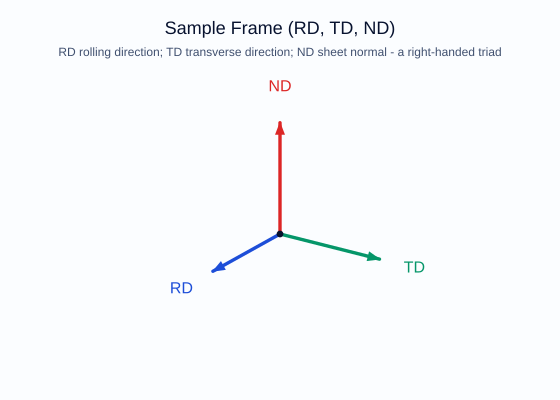

# Reference Frame Foundation

This document is the authoritative description of how PyTex represents, relates, and draws
reference frames. It sits under [Canonical Data Model](canonical_data_model.md) and refines the
frame rules fixed in [Notation And Conventions](../standards/notation_and_conventions.md).



The figure above is a **generated** asset: `scripts/generate_reference_frame_figures.py` produces it
from `pytex.plotting.frames`, using the same public code path a user calls. A documentation figure
therefore cannot drift from the model it illustrates.

## Why This Foundation Exists

Every scientific quantity in a texture or diffraction workflow — a direction, a plane normal, a
pole, a detector coordinate, an orientation — is three numbers that mean nothing without a frame.
Historically each PyTex module built the frames it needed inline. That is exactly the pattern the
repository's non-negotiable rules forbid:

> No subsystem may define its own private frame or symmetry model. (`AGENTS.md`)

The foundation replaces that with one model that answers five questions:

1. **How is a frame created?** From the catalog, by name, or explicitly.
2. **How is a frame described?** By domain, axis labels, axis geometry, handedness, and provenance.
3. **How are frames related?** By typed, invertible, composable transforms.
4. **How is a relationship resolved when it was never declared directly?** By a frame graph.
5. **How is a frame seen?** By one triad model with three renderers.

## The Three Types

### `ReferenceFrame`

A frame carries both its **identity** and its **geometry**:

| Field | Meaning |
| --- | --- |
| `name` | Stable identifier, unique within a workflow or graph |
| `domain` | A member of the fixed `FrameDomain` vocabulary |
| `axes` | The three axis labels, in order (`("RD", "TD", "ND")`) |
| `axis_vectors` | Where those axes point, as canonical Cartesian components |
| `axis_descriptions` | Optional long names (`"rolling direction"`) |
| `handedness` | `RIGHT` (canonical) or `LEFT` |
| `convention` | The governing `ConventionSet` |
| `provenance` | Optional import/source record |

#### The axis-vector convention

`axis_vectors` gives the components of the frame's three labelled axes **in the canonical
right-handed Cartesian reference** `X, Y, Z` (`CARTESIAN_FRAME`). The default is the identity
triad, meaning "this frame's axes coincide with the canonical Cartesian axes" — the standing
convention for the specimen frame, the sample frame, and the default crystal frame.

One shared reference is what makes `FrameTransform.between_frames` well defined: two frames whose
axis vectors are quoted in a common reference already determine their relative rotation.

`basis_matrix` exposes the geometry as a `(3, 3)` array whose **columns** are the axis vectors, so
`x_cartesian = frame.basis_matrix @ v_frame`.

#### Frame geometry is not a lattice basis

`ReferenceFrame.axis_vectors` is a dimensionless axis *orientation*.
`pytex.core.lattice.Lattice.direct_basis` returns a `Basis` with physical lengths (angstrom) and a
`BasisKind`. The two are complementary and must not be conflated: a `Basis` says how long the
crystal axes are, a frame says which directions its labels point.

#### Construction-time invariants

Preferring construction-time checks over downstream recovery, a frame rejects:

- axis labels that are not exactly three;
- axis vectors that are non-finite or linearly dependent (a frame must span three dimensions);
- a declared handedness whose sign contradicts the axis-vector determinant.

Non-orthonormal axis vectors are **allowed** — an oblique crystal frame is legitimate — and
reported through `is_orthonormal` rather than rejected. Visualization normalizes them for
legibility.

#### Why the geometry is stored as tuples

Frame equality is load-bearing: `VectorSet`, `FrameTransform`, `Orientation`, and `SymmetrySpec`
all compare frames to detect inconsistency. A NumPy array field would make `==` ambiguous, so the
axis triad is stored as a hashable tuple of float triples and `basis_matrix` builds the array on
demand.

### `FrameTransform`

A typed rigid map between exactly two named frames, applied as

```text
v_target = R @ v_source + t
```

so `rotation_matrix` converts **components in the source frame into components in the target
frame**. `R` is validated to be orthonormal with determinant `+1` at construction.

Constructors, chosen so a relationship can be stated the way it is actually known:

| Constructor | Use when the relationship is known as |
| --- | --- |
| `identity` | nothing to do |
| `from_rotation` | a `Rotation`, quaternion, or orientation matrix |
| `from_bunge_euler` | Bunge `(phi1, Phi, phi2)` angles |
| `from_axis_angle` | a tilt or stage rotation |
| `from_axis_correspondence` | words: "specimen x is the sample TD axis" |
| `between_frames` | both frames' own axis geometry |

`from_axis_correspondence` is the readable way to express the axis-relabelling conventions that
differ between EBSD vendors. It is a statement about *components*: in its own coordinates a frame's
axis `i` is the standard basis vector `e_i`, so "source axis `i` is target axis `j`" fixes
`R e_i = ±e_j`, giving a signed permutation matrix independent of where either frame's axes happen
to point. An odd permutation without a compensating sign flip is a mirror, not a rotation, and is
rejected.

#### Directions versus positions

`apply_to_vectors` applies the rotation **and** the translation; `apply_to_directions` applies the
rotation **only**. Directions, plane normals, and poles are translation-invariant, so an origin
offset must not move them. Using the wrong one is a silent scientific error, which is why they are
separate named methods rather than a flag.

#### `source_axes_in_target`

Returns the `(3, 3)` matrix whose columns are the source frame's axes as components in the target
frame. It returns a **matrix, not a frame**, deliberately: those components are expressed in the
target frame rather than in the canonical Cartesian reference, so wrapping them in a
`ReferenceFrame` would quietly break the axis-vector convention above.

### `FrameGraph`

A registry of frames and the transforms declared between them. Edges are usable in **both**
directions (the reverse direction is realized with `FrameTransform.inverse`), and
`transform_between` composes the **shortest** declared chain by breadth-first search.

Shortest-path resolution is not an optimization detail: each composition multiplies rotation
matrices, so the fewest hops means the least accumulated floating-point error and the clearest
provenance.

A workflow therefore declares only the relationships it actually measured. An EBSD dataset that
knows `crystal -> specimen` and `specimen -> map` can be asked for `crystal -> map` directly.

Errors are explicit: an unregistered frame, a frame name registered with two different
definitions, and a pair of frames with no declared path each raise with the registered frames
listed.

## The Standard Frame Catalog

`pytex.core.frame_catalog` builds the frames every workflow expects, once.

| Slug | Constant | Domain | Axes |
| --- | --- | --- | --- |
| `cartesian` | `CARTESIAN_FRAME` | laboratory | `X, Y, Z` |
| `specimen` | `SPECIMEN_FRAME` | specimen | `x, y, z` |
| `sample` | `SAMPLE_RD_TD_ND_FRAME` | specimen | `RD, TD, ND` |
| `crystal` | `CRYSTAL_FRAME` | crystal | `a, b, c` |
| `map` | `MAP_FRAME` | map | `x, y, z` |
| `detector` | `DETECTOR_FRAME` | detector | `u, v, n` |
| `laboratory` | `LABORATORY_FRAME` | laboratory | `x_lab, y_lab, z_lab` |

Each has a matching builder (`sample_frame(...)`, `crystal_frame(...)`, ...) for workflows holding
several frames of the same kind — two phases, two detectors, a parent and a child crystal.
`reciprocal_frame_for(crystal_frame)` produces the dual frame with starred axis labels
(`a -> a*`); `pytex.core.lattice.Lattice.reciprocal_basis` uses it.



### Identity preservation

The builder defaults are pinned to exactly the field values this repository's modules used before
the catalog existed. Adopting the catalog therefore never changes a frame's identity, which is why
migrating every module was a behaviour-preserving change. `tests/unit/test_frame_catalog.py`
asserts this directly against hand-built frames; if one of those tests fails, a catalog default has
drifted and cross-module frame identity is broken.

### Domain vocabulary is closed

Every catalog frame uses a member of the fixed `FrameDomain` vocabulary — `crystal, specimen, map,
detector, laboratory, reciprocal`. New stable domains may not be invented
([Notation And Conventions](../standards/notation_and_conventions.md)).

## Visualization And Embedding

`pytex.plotting.frames` renders the *same* frame three ways from one geometry computation
(`FrameTriad`), so a frame looks identical wherever it appears.

### 1. Scene primitives

`frame_triad` and `frame_triad_primitives` produce `AxisTriad3D` / `PrimitiveScene3D` objects that
drop straight into the existing 3D crystal and world-scene renderers — for instance to show the
specimen `RD/TD/ND` triad beside a rendered grain. `reference_frame_triad` in
`pytex.plotting.primitives` now reads a frame's `axis_vectors` too, so a frame recorded as rotated
draws rotated.

### 2. Embeddable gizmo

`add_frame_indicator(ax, frame, ...)` adds a small orientation indicator to a corner of **any**
existing matplotlib axes, including polar axes. This is the standard way a PyTex figure states its
frame without a prose caption:

- a simulated SAED diffractogram showing the detector `u/v` axes;
- a pole figure showing `RD` and `TD` (use `axis_subset` to drop the axis pointing at the viewer);
- an IPF or KAM map showing the map axes;
- a projected crystal-viewer panel.

Axes pointing away from the viewer are drawn thinner and paler so depth reads correctly, and labels
are held clear of the origin so a strongly foreshortened axis still gets a legible label. A `basis`
override lets the gizmo draw a frame's axes in the host figure's coordinates rather than the
canonical Cartesian reference, which is what the wired-in renderers below use.

Three renderers accept the gizmo directly, all **opt-in** so existing figures are unchanged:

| Renderer | Option | What it shows |
| --- | --- | --- |
| `plot_saed_pattern` | `show_frame_indicator=True` | the pattern's detector `u`/`v` axes (the normal is omitted: it points at the viewer) |
| `render_composite_saed` | `CompositeSAEDPlotConfig(show_frame_indicator=True)` | the **parent crystal** axes as they land on this detector, via the pattern's parent-anchored zone basis |
| `plot_crystal_structure_3d` | `show_frame_indicator=True` | the phase's `a`/`b`/`c` axes drawn from the lattice basis, at the figure's own view angles, so an oblique cell's gizmo leans the way the cell does |

### 3. Documentation SVG

`reference_frame_svg` and `frame_catalog_svg` emit complete, style-guide-compliant SVG documents in
pure Python, with **no matplotlib involved**. This keeps the documentation path import-light and is
what `scripts/generate_reference_frame_figures.py` uses. Output follows
[Visualization Style Guide](../standards/visualization_style_guide.md): Arial-family text, the
canonical ink/paper tokens, and mandatory `<title>` and `<desc>` elements — the `<desc>` carries the
frame's own `describe()` prose, so the figure is accessible and self-documenting.

### Shared projection and palette

The 2D renderers use an orthographic projection specified the way matplotlib's 3D axes specify a
view (`elev_deg`, `azim_deg`), defaulting to the same view as the 3D crystal renderer so a gizmo
and the scene it annotates agree. Axis colors come from `TRIAD_AXIS_COLORS`, the Okabe-Ito derived
palette already fixed in `pytex.plotting.primitives`, so axis identity survives grayscale printing
and common color-vision deficiencies.

## Explainability

`ReferenceFrame`, `FrameTransform`, `FrameGraph`, and `FrameTriad` each expose `describe()` per the
explainable-results doctrine. The prose is convention-explicit: a frame states its domain,
handedness, orthonormality, where each axis points and in what reference, and the governing
convention set; a transform states its endpoints, rotation angle and axis, origin offset, and the
direction in which components are mapped.

`describe()` and the JSON contracts stay in lockstep: `pytex.contracts` serializes `axis_vectors`
and `axis_descriptions`, and deserialization supplies the identity triad and empty descriptions for
payloads written before those fields existed, so older files still round-trip to equal objects.

## Verification

- `tests/unit/test_frames.py` — geometry, invariants, derivation, every constructor, application
  semantics, and `describe()`.
- `tests/unit/test_frame_catalog.py` — catalog contents, identity preservation against hand-built
  frames, reciprocal frames, and frame-graph resolution.
- `tests/unit/test_frame_visualization.py` — projection identities, triad model, scene primitives,
  gizmo behaviour on Cartesian and polar axes, and SVG structure including the mandatory
  style-guide elements.
- `docs/site/examples/generated/reference_frames.md` — executable worked examples whose expected
  values come from exact rotation-matrix identities and International-Tables axis conventions.

## References

### Normative

- Hahn, Th. (ed.), *International Tables for Crystallography, Volume A: Space-Group Symmetry*,
  IUCr / Springer, DOI: <https://doi.org/10.1107/97809553602060000100>.
- Bunge, H.-J., *Texture Analysis in Materials Science: Mathematical Methods*, Butterworths,
  DOI: <https://doi.org/10.1016/C2013-0-11769-2>.
- [Notation And Conventions](../standards/notation_and_conventions.md)
- [Canonical Data Model](canonical_data_model.md)

### Informative

- `docs/site/concepts/reference_frames_and_conventions.md` — the user-facing concept page, which
  links back here. (Referenced by path rather than as a link because this note is rendered into the
  Sphinx site from `docs/architecture/`, where a site-relative link would not resolve.)
- [Visualization Style Guide](../standards/visualization_style_guide.md)
- Nolze, G. et al., *Journal of Applied Crystallography* (2023),
  DOI: <https://doi.org/10.1107/S1600576723009275>.
