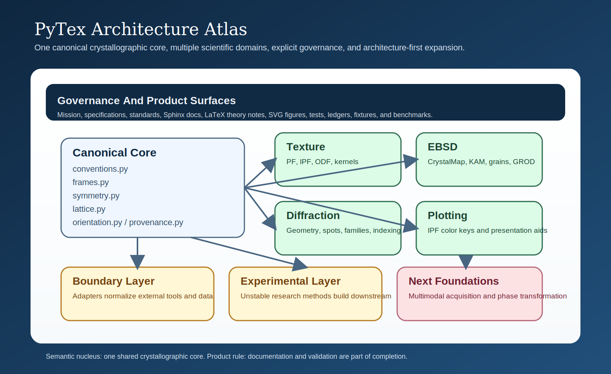
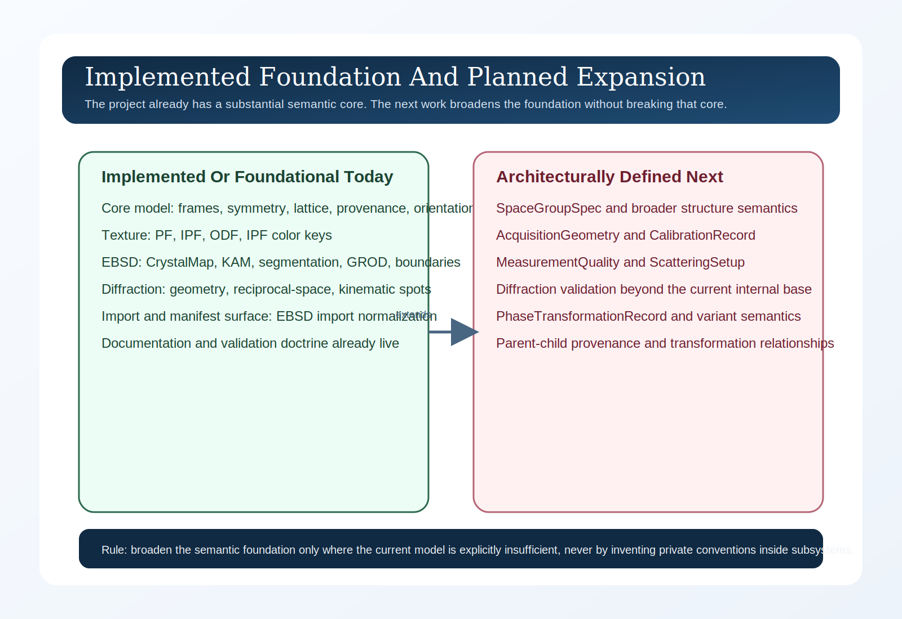

# Library Structure

This page is the architecture atlas for PyTex.

:::{raw} html
<p class="architecture-lead">
It is meant to give a reader a fast, accurate mental model of the library before they dive into implementation details. The diagrams below do not merely mirror the folder tree. They explain how PyTex is organized semantically, how scientific data moves through the system, how documentation and validation govern the codebase, and how the current implementation relates to the next planned foundations.
</p>
:::

## At A Glance

PyTex is organized around four non-negotiable ideas:

- one canonical crystallographic core
- multiple domain modules that reuse that core
- adapters that normalize external data into PyTex semantics
- documentation and validation as first-class product surfaces

That structure is what lets the project remain texture-led while expanding toward EBSD, diffraction, and future phase-transformation and multimodal workflows.

::::{grid} 1 1 2 2
:gutter: 3

:::{grid-item-card} Semantic Nucleus
:class-card: sd-shadow-sm
PyTex is built around one canonical crystallographic core for frames, symmetry, lattice, orientation, reciprocal-space, and provenance semantics.
:::

:::{grid-item-card} Domain Expansion
:class-card: sd-shadow-sm
Texture, EBSD, diffraction, and plotting are downstream scientific layers that must reuse the same core model rather than inventing private conventions.
:::

:::{grid-item-card} Boundary Discipline
:class-card: sd-shadow-sm
Adapters live at the normalization boundary. They are responsible for translation into PyTex semantics, not for defining the stable product surface.
:::

:::{grid-item-card} Completion Doctrine
:class-card: sd-shadow-sm
Documentation, figures, tests, ledgers, and benchmark placeholders are architectural surfaces. They are part of feature completion, not release polish.
:::
::::

:::{raw} html
<div class="architecture-poster">
  
</div>
:::

:::{raw} html
<div class="architecture-poster">
  
</div>
:::

## Poster Series

The poster below is designed as the primary reusable figure for talks, README summaries, and high-level architecture discussions.

It is intentionally poster-like: it compresses the whole project into a single view while preserving the semantic hierarchy of governance, core model, domain modules, boundary layers, and next foundations.

## Visual Legend

::::{grid} 1 1 4 4
:gutter: 2

:::{grid-item-card} Governance
:class-card: sd-shadow-sm
Mission, standards, documentation, and validation layers that control what the code is allowed to claim.
:::

:::{grid-item-card} Core
:class-card: sd-shadow-sm
Canonical objects and semantics shared across all scientific workflows.
:::

:::{grid-item-card} Domain
:class-card: sd-shadow-sm
Texture, EBSD, diffraction, and presentation-facing modules built on the core.
:::

:::{grid-item-card} Growth
:class-card: sd-shadow-sm
Boundary layers and future foundations that extend the system without weakening the existing contracts.
:::
::::

## 1. System Structure

:::{raw} html
<p class="architecture-section-intro">
This first diagram is the top-level structural map. It shows the code structure as a semantic system rather than as a bare directory tree.
</p>
:::

```{mermaid}
flowchart TB
    mission["Mission, Specifications, Standards<br/>Mission, specifications, governance, notation,<br/>reference canon, manifest policy"]
    docs_surface["Documentation Surface<br/>Sphinx site, LaTeX theory notes, SVG figures"]
    validation["Validation Surface<br/>Unit tests, parity ledgers, integration tests,<br/>fixtures, benchmark placeholders"]

    subgraph core_layer["Canonical Core"]
        conventions["conventions.py<br/>ConventionSet, frame domains, basis kinds"]
        frames["frames.py<br/>ReferenceFrame, FrameTransform"]
        symmetry["symmetry.py<br/>SymmetrySpec, operators, sectors"]
        lattice["lattice.py<br/>Lattice, Basis, UnitCell, Phase,<br/>MillerIndex, CrystalPlane, ReciprocalLatticeVector"]
        orientation["orientation.py<br/>Rotation, Orientation, Misorientation, OrientationSet"]
        provenance["provenance.py<br/>ProvenanceRecord"]
    end

    subgraph domain_layer["Domain Modules"]
        texture["texture/<br/>PoleFigure, InversePoleFigure, ODF, KernelSpec"]
        ebsd["ebsd/<br/>CrystalMap, KAM, segmentation, GROD,<br/>boundaries, grain graphs"]
        diffraction["diffraction/<br/>DiffractionGeometry, DiffractionPattern,<br/>KinematicSimulation, ReflectionFamily, indexing"]
        plotting["plotting/<br/>IPFColorKey and presentation-facing helpers"]
    end

    subgraph boundary_layer["Boundary And Growth Layers"]
        adapters["adapters/<br/>Import normalization, manifest IO,<br/>third-party bridges"]
        experimental["experimental/<br/>Future unstable research methods"]
    end

    subgraph future_foundations["Documented Next Foundations"]
        multimodal["Multimodal characterization foundation<br/>AcquisitionGeometry, CalibrationRecord,<br/>MeasurementQuality, ScatteringSetup"]
        transformation["Phase transformation foundation<br/>OrientationRelationship, TransformationVariant,<br/>PhaseTransformationRecord"]
    end

    mission --> docs_surface
    mission --> validation
    mission --> conventions
    mission --> frames
    mission --> symmetry
    mission --> lattice
    mission --> orientation

    conventions --> frames
    conventions --> lattice
    frames --> lattice
    frames --> orientation
    symmetry --> orientation
    lattice --> orientation
    provenance --> orientation
    provenance --> lattice

    orientation --> texture
    lattice --> texture
    symmetry --> texture

    orientation --> ebsd
    frames --> ebsd
    lattice --> ebsd
    provenance --> ebsd

    orientation --> diffraction
    frames --> diffraction
    lattice --> diffraction
    symmetry --> diffraction
    provenance --> diffraction

    symmetry --> plotting
    orientation --> plotting
    texture --> plotting

    core_layer --> adapters
    ebsd --> adapters
    diffraction --> adapters

    core_layer --> experimental
    texture --> experimental
    ebsd --> experimental
    diffraction --> experimental

    mission --> multimodal
    mission --> transformation
    multimodal -.extends.-> ebsd
    multimodal -.extends.-> diffraction
    transformation -.extends.-> orientation
    transformation -.extends.-> lattice

    docs_surface --> core_layer
    docs_surface --> domain_layer
    docs_surface --> future_foundations
    validation --> core_layer
    validation --> domain_layer
    validation --> adapters

    classDef governance fill:#102a43,stroke:#486581,color:#f0f4f8,stroke-width:1.5px;
    classDef core fill:#f0f4f8,stroke:#334e68,color:#102a43,stroke-width:1.5px;
    classDef domain fill:#d9f2e6,stroke:#2d6a4f,color:#1b4332,stroke-width:1.5px;
    classDef boundary fill:#fff3d6,stroke:#b7791f,color:#744210,stroke-width:1.5px;
    classDef future fill:#fde2e4,stroke:#b56576,color:#6d1f2f,stroke-width:1.5px;

    class mission,docs_surface,validation governance;
    class conventions,frames,symmetry,lattice,orientation,provenance core;
    class texture,ebsd,diffraction,plotting domain;
    class adapters,experimental boundary;
    class multimodal,transformation future;
```

### Reading This View

- The canonical core is the semantic nucleus of the library.
- Texture, EBSD, diffraction, and plotting are downstream scientific layers, not separate semantic islands.
- Adapters are boundary modules. They translate into PyTex semantics rather than owning them.
- Documentation and validation sit above the codebase because in PyTex they define what counts as a finished feature.
- The future-foundations block is not speculative fluff. It is the documented expansion path for the next stable API families.

## 2. Scientific Data Flow

:::{raw} html
<p class="architecture-section-intro">
This second diagram shows how scientific information is intended to move through the library: normalization at the boundary, canonical objects in the middle, domain workflows downstream, and documentation plus validation surrounding the flow.
</p>
:::

```{mermaid}
flowchart LR
    external["External Sources<br/>Vendor EBSD data, CIF files, third-party objects,<br/>future diffraction datasets"]
    adapters["Adapters And Import Contracts<br/>Manifest validation, normalization, provenance capture"]
    core["Canonical Core Objects<br/>Frames, symmetry, lattice, phase, orientation,<br/>reciprocal-space, provenance"]
    domain["Domain Workflows<br/>Texture, EBSD, diffraction, plotting"]
    outputs["Scientific Outputs<br/>Arrays with meaning, reports, figures,<br/>workflow artifacts, future manifests"]
    docs["Documentation And Theory<br/>Concept pages, workflow docs,<br/>LaTeX notes, SVG figures"]
    tests["Validation And Reproducibility<br/>Unit tests, parity fixtures,<br/>integration tests, benchmark placeholders"]

    external --> adapters
    adapters --> core
    core --> domain
    domain --> outputs

    docs --> adapters
    docs --> core
    docs --> domain

    tests --> adapters
    tests --> core
    tests --> domain
    tests --> outputs

    outputs -.traceability.-> core
    outputs -.method provenance.-> adapters

    classDef source fill:#f8f9fa,stroke:#6c757d,color:#212529,stroke-width:1.5px;
    classDef process fill:#e8f1ff,stroke:#335c81,color:#1d3557,stroke-width:1.5px;
    classDef evidence fill:#edf6f9,stroke:#2a9d8f,color:#1d3557,stroke-width:1.5px;

    class external source;
    class adapters,core,domain,outputs process;
    class docs,tests evidence;
```

### Reading This View

- PyTex is designed around one-way normalization into canonical objects.
- Internal algorithms should operate on PyTex domain types, not on source-native objects.
- Documentation and validation are attached to the flow, not bolted on afterward.
- Outputs are expected to remain traceable back to conventions, inputs, and normalization boundaries.
- The data-flow model is intentionally conservative because scientific clarity matters more than API cleverness.

## 3. Governance And Completion Model

:::{raw} html
<p class="architecture-section-intro">
This third diagram explains why PyTex development is deliberately constrained by standards, architecture docs, and validation policy.
</p>
:::

```{mermaid}
flowchart TB
    idea["New Scientific Capability"]
    standards["Standards Layer<br/>Notation, reference canon, manifests,<br/>engineering and documentation rules"]
    architecture["Architecture Layer<br/>Canonical model, subsystem foundations,<br/>multimodal and transformation doctrine"]
    implementation["Implementation Layer<br/>Core, texture, EBSD, diffraction, adapters"]
    docs["Docs Layer<br/>Sphinx concept/workflow pages,<br/>LaTeX notes, SVG figures"]
    validation["Validation Layer<br/>Unit tests, parity matrices,<br/>integration tests, benchmark placeholders"]
    release["Stable Feature Claim"]

    idea --> standards
    standards --> architecture
    architecture --> implementation
    implementation --> docs
    implementation --> validation
    docs --> release
    validation --> release

    standards -.policy gates.-> implementation
    architecture -.semantic constraints.-> docs
    architecture -.semantic constraints.-> validation

    classDef start fill:#fff7e6,stroke:#d97706,color:#7c2d12,stroke-width:1.5px;
    classDef guard fill:#ede9fe,stroke:#6d28d9,color:#3b0764,stroke-width:1.5px;
    classDef build fill:#e0f2fe,stroke:#0369a1,color:#0c4a6e,stroke-width:1.5px;
    classDef finish fill:#dcfce7,stroke:#15803d,color:#14532d,stroke-width:1.5px;

    class idea start;
    class standards,architecture guard;
    class implementation,docs,validation build;
    class release finish;
```

### Reading This View

- PyTex does not treat implementation alone as completion.
- Standards and architecture documents are upstream decision surfaces.
- A stable feature claim is only valid after docs and validation exist alongside the code.
- This is the mechanism that keeps the project from drifting as it grows beyond texture into broader crystallography.

## 4. Current State Versus Planned Expansion

:::{raw} html
<p class="architecture-section-intro">
This final diagram separates the current implemented foundation from the next layers that are implemented foundationally today versus still ahead as broader expansion work.
</p>
:::

```{mermaid}
flowchart LR
    subgraph current["Implemented Or Foundational Today"]
        current_core["Core model<br/>frames, symmetry, lattice, provenance,<br/>batch semantics, orientation, transformation"]
        current_texture["Texture foundation<br/>PF, IPF, ODF, IPF color keys"]
        current_ebsd["EBSD foundation<br/>CrystalMap, KAM, segmentation, GROD,<br/>boundaries, cleanup, grain graphs"]
        current_diffraction["Diffraction foundation<br/>geometry, reciprocal-space, kinematic spots,<br/>families, ranking and local refinement"]
        current_manifests["Current manifest surface<br/>import, experiment, benchmark,<br/>validation, workflow-result"]
    end

    subgraph next["Architecturally Defined Next"]
        next_spacegroup["Structure hardening<br/>broader external baselines and richer CIF corpora"]
        next_multimodal["Multimodal workflow depth<br/>broader XRD, neutron, TEM,<br/>and richer experiment integration"]
        next_validation["Expanded validation<br/>diffraction baselines, structure-import doctrine,<br/>broader benchmark manifests"]
        next_transformation["Transformation expansion<br/>variant generation, parent reconstruction,<br/>and stronger literature-backed validation"]
    end

    current_core --> current_texture
    current_core --> current_ebsd
    current_core --> current_diffraction
    current_core --> current_manifests

    current_core ==> next_spacegroup
    current_ebsd ==> next_multimodal
    current_diffraction ==> next_multimodal
    current_diffraction ==> next_validation
    current_manifests ==> next_validation
    current_core ==> next_transformation

    classDef currentfill fill:#ecfdf5,stroke:#059669,color:#064e3b,stroke-width:1.5px;
    classDef nextfill fill:#fff1f2,stroke:#be123c,color:#881337,stroke-width:1.5px;

    class current_core,current_texture,current_ebsd,current_diffraction,current_manifests currentfill;
    class next_spacegroup,next_multimodal,next_validation,next_transformation nextfill;
```

### Reading This View

- PyTex already has a substantial implemented foundation.
- The next major work is not “add more features blindly.” It is to deepen validation and workflow breadth on top of the now-stronger semantic foundation.
- The gap between “implemented today” and “planned next” is intentionally documented so future contributors do not guess.

## Summary

The architecture of PyTex can be reduced to four ideas:

- one canonical crystallographic core
- multiple downstream scientific domains
- adapters at the boundary, not in the center
- documentation and validation as first-class architectural surfaces

That combination is what makes PyTex a scientific infrastructure project rather than just a collection of analysis routines.

## Related Material

- {doc}`core_model`
- {doc}`core_foundation`
- {doc}`orientation_texture`
- {doc}`texture_foundation`
- {doc}`ebsd_foundation`
- {doc}`diffraction_foundation`
- `docs/architecture/overview.md`
- `docs/architecture/multimodal_characterization_foundation.md`
- `docs/architecture/phase_transformation_foundation.md`

## References

### Normative

- `docs/architecture/overview.md`
- `docs/architecture/canonical_data_model.md`
- `docs/standards/reference_canon.md`

### Informative

- `docs/architecture/repo_review_2026_foundation_audit.md`
