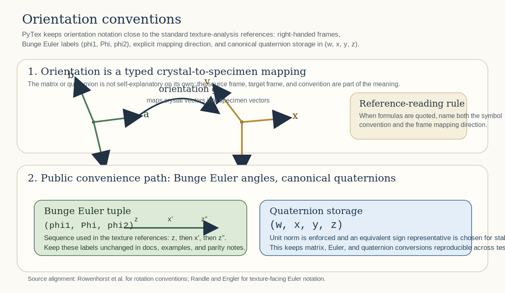
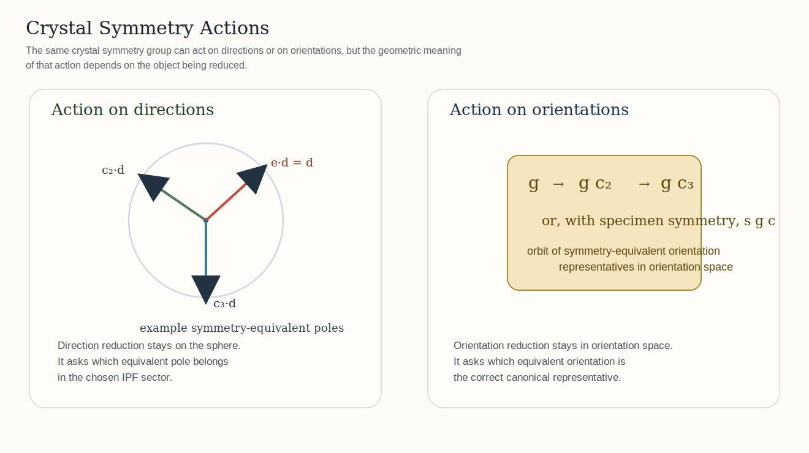
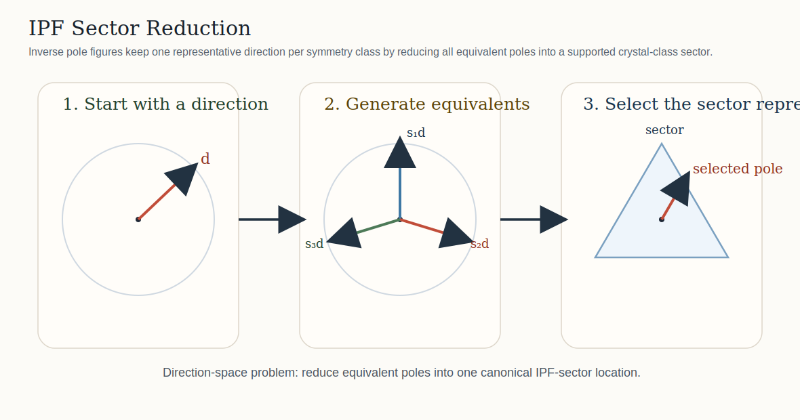
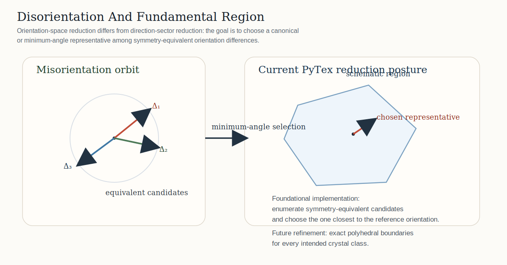
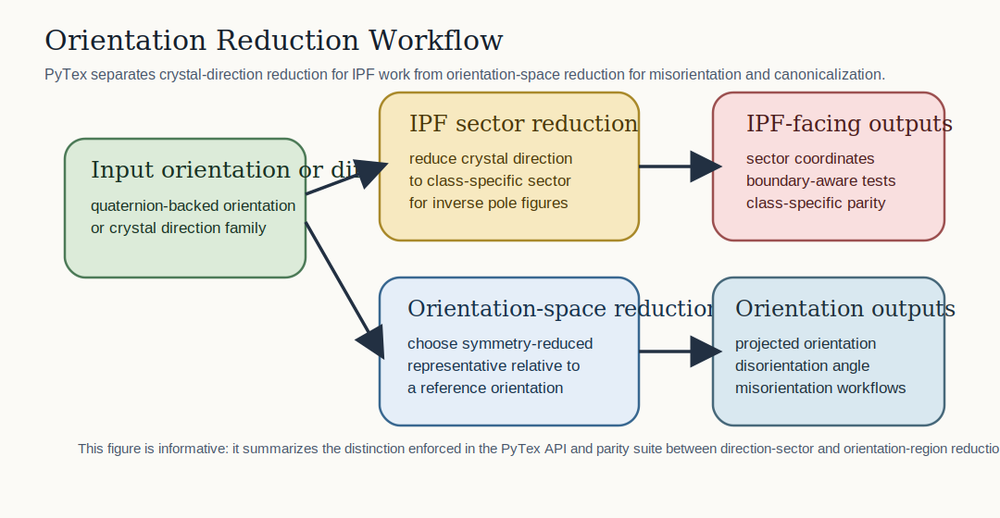

# Orientation And Texture

The orientation and texture layer fixes semantics first and then grows algorithms and plotting on top of those semantics. This is why PyTex starts with convention-aware rotations, symmetry-aware misorientation, and explicit pole-figure or inverse-pole-figure objects before attempting broader visual or inversion breadth.

## What The Layer Covers

At this stage, PyTex provides a coherent orientation foundation for:

- quaternion-backed rotations
- Bunge, Matthies, and ABG Euler import and export
- symmetry-aware misorientation and disorientation
- class-specific IPF sector reduction for supported point groups
- explicit projection of orientations to symmetry-reduced representatives
- explicit symmetry-reduced fundamental-region keys for stable orientation comparison
- kernel-based ODF evaluation and PF reconstruction
- classical contour pole-figure rendering on projected density grids
- classical Bunge-section ODF rendering for contour-style inspection
- discrete pole-figure inversion over an explicit orientation dictionary
- explicit IPF color-key generation from symmetry-reduced crystal directions

## Why Conventions Matter

Orientation work becomes unreliable as soon as a library leaves the rotation convention implicit. The same three numbers can mean different ordered axes, active versus passive interpretations, or radians versus degrees. PyTex therefore exposes convention-aware conversion entry points and keeps the stable Bunge helpers as explicit convenience APIs.



## Euler And Quaternion Semantics In PyTex

### Euler Conventions

- `bunge`: the familiar ZXZ-style convention used widely in texture analysis
- `matthies`: a ZYZ-style convention used in several texture and diffraction contexts
- `abg`: exposed explicitly because tool chains often label Matthies-style angles as `alpha, beta, gamma`

### Quaternion Storage

PyTex stores quaternions in canonical `(w, x, y, z)` order, enforces unit normalization, and exposes conversion methods that keep sign-equivalent quaternions from becoming a hidden source of instability in tests or workflow boundaries.

```{note}
PyTex follows its own explicit stable API names and documents MTEX parity as validation, not as a license to inherit every MTEX public naming choice.
```

## Symmetry Reduction And Fundamental Regions

Two different reduction problems matter in practice:

- reducing a crystal direction into the correct inverse-pole-figure sector
- reducing an orientation or misorientation into a symmetry-reduced representative in orientation space

Those problems are related but not identical. PyTex keeps them distinct in both the code and the documentation so that parity tests can target the correct mathematical surface.

```{important}
For the full mathematical and geometric explanation, read {doc}`symmetry_and_fundamental_regions`. That page is the canonical Sphinx walkthrough for symmetry action, orbit construction, direction-sector reduction, orientation representative selection, and disorientation.
```



### Symmetry Actions On Directions And Orientations

Crystal symmetry acts on more than one mathematical object in this layer.

- for direction reduction, symmetry acts on unit vectors and produces symmetry-equivalent poles
- for orientation reduction, symmetry acts on orientations and generates an orbit of equivalent representations
- for disorientation, the relevant result is the minimum-angle representative within that orbit

The important teaching point is that “apply symmetry” does not mean “always do the same operation.” The geometric object being reduced determines the correct symmetry action.



### Inverse Pole Figure Sectors

An inverse pole figure does not keep every symmetry-equivalent crystal direction. Instead, it reduces all equivalent directions into a single class-specific sector. PyTex implements that reduction explicitly for the currently supported point groups.

- start from a crystal direction family
- generate all symmetry-equivalent directions
- select the representative that lies in the supported IPF sector

This is a direction-space reduction problem, not an orientation-space one.



### Disorientation And Orientation-Space Reduction

When PyTex reduces an orientation or compares two orientations under symmetry, the object being reduced lives in orientation space rather than on the unit sphere of directions.

- a misorientation gives one rotational difference before symmetry reduction
- symmetry generates equivalent candidates
- the current PyTex implementation selects the exact minimum-angle symmetry representative in the quaternion hemisphere, or the closest representative to a supplied reference orientation when a workflow needs reference-aware projection

This is why the documentation and parity suite treat IPF-sector reduction and fundamental-region reduction as distinct surfaces.



## Implemented

- Bunge and Matthies or ABG Euler import and export on quaternion-backed rotations
- symmetry-aware misorientation and disorientation
- pole-figure and inverse-pole-figure containers
- class-specific IPF sector reduction for supported point groups
- explicit orientation projection to a symmetry-reduced representative relative to a reference orientation
- explicit symmetry-reduced fundamental-region keys for parity and workflow comparison
- kernel-based ODF evaluation and PF reconstruction
- contour pole-figure rendering from smoothed projected densities
- contour ODF visualization in Euler space and as Bunge sections
- discrete dictionary-based pole-figure inversion with an explicit `ODFInversionReport`

## Still Ahead

- closed-form class-by-class boundary catalogs for the exact orientation-space regions
- harmonic ODF expansion and broader experimentally calibrated PF-to-ODF inversion
- full MTEX-level parity for IPF color coding and richer publication-grade rendered plotting surfaces

## Related Material

- `docs/architecture/orientation_and_texture_foundation.md`
- [../../tex/theory/euler_convention_handling.tex](../../tex/theory/euler_convention_handling.tex)
- [../../tex/theory/fundamental_region_reduction.tex](../../tex/theory/fundamental_region_reduction.tex)
- [../../tex/theory/orientation_space_and_disorientation.tex](../../tex/theory/orientation_space_and_disorientation.tex)
- [../../tex/algorithms/discrete_odf_and_pole_figures.tex](../../tex/algorithms/discrete_odf_and_pole_figures.tex)
- [../../figures/crystal_symmetry_actions.svg](../../figures/crystal_symmetry_actions.svg)
- [../../figures/ipf_sector_reduction.svg](../../figures/ipf_sector_reduction.svg)
- [../../figures/disorientation_fundamental_region.svg](../../figures/disorientation_fundamental_region.svg)
- [../../figures/orientation_conventions.svg](../../figures/orientation_conventions.svg)
- [../../figures/orientation_reduction_workflow.svg](../../figures/orientation_reduction_workflow.svg)
- [../../figures/pole_figure_construction.svg](../../figures/pole_figure_construction.svg)
- {doc}`symmetry_and_fundamental_regions`

## References

### Normative

- `docs/standards/notation_and_conventions.md`
- `docs/architecture/orientation_and_texture_foundation.md`

### Informative

- Nolze et al., [Texture measurements on quartz single crystals to validate coordinate systems for neutron time-of-flight texture analysis](https://journals.iucr.org/j/issues/2023/06/00/xx5024/)
- MTEX documentation: [Misorientations](https://mtex-toolbox.github.io/Misorientations.html)
- Bunge, *Texture Analysis in Materials Science* (1982)
