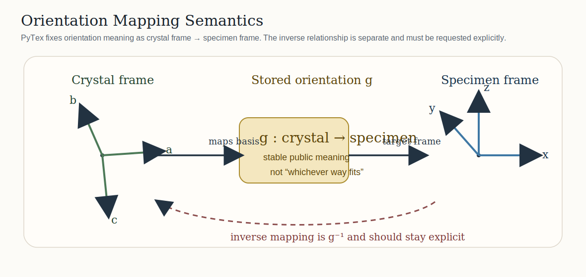
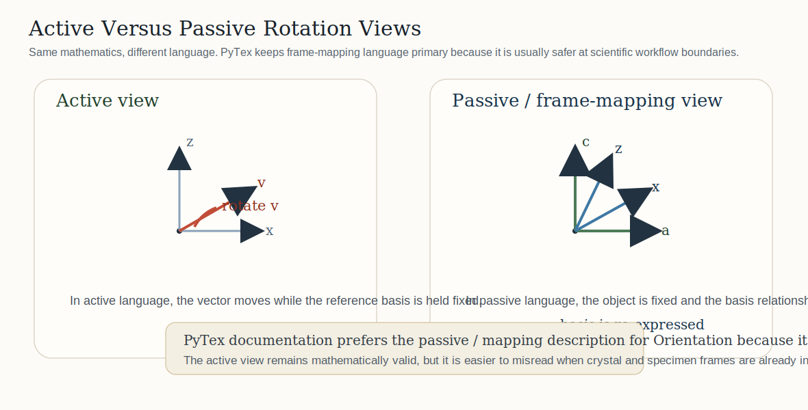
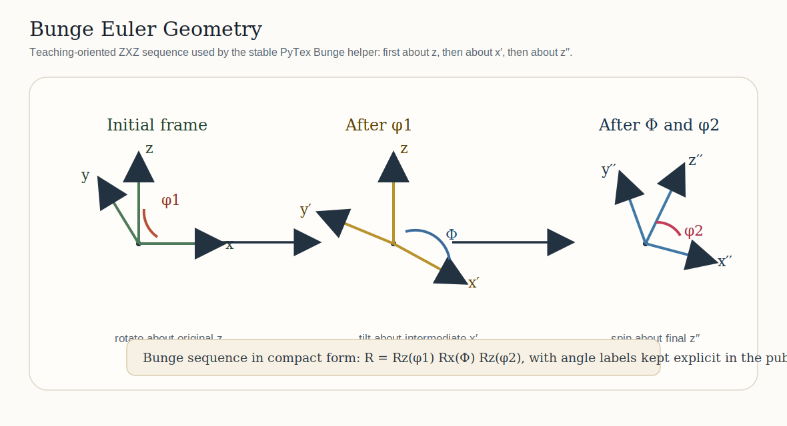

# Reference Frames And Orientation Conventions

This page is the compact reference for how PyTex defines reference-frame semantics and orientation conventions in the stable public API.

## The Core Rule

PyTex does not allow reference-frame meaning to remain implicit. An orientation is not just a rotation matrix or three Euler angles. In the stable model it is an explicitly typed relationship between:

- a crystal-attached frame
- a specimen-attached frame
- a convention-aware rotation representation
- an optional crystal symmetry model

That rule is what makes later EBSD, texture, and diffraction workflows interpretable across modules and tool boundaries.

## Canonical Frame Vocabulary

PyTex uses a shared repository-wide vocabulary for the most important frame domains.


### Crystal Frame

- attached to the phase or lattice
- typically labeled by crystal axes such as `a, b, c`
- the natural home for directions, planes, and symmetry operators

### Specimen Frame

- attached to the sample or macroscopic specimen
- typically labeled by specimen axes such as `x, y, z`
- the target frame for texture and EBSD orientation interpretation

### Map Frame

- attached to scan coordinates
- used for EBSD grid layout and neighbor topology
- not interchangeable with the specimen frame unless a workflow makes that relationship explicit

### Detector Frame

- attached to image or diffraction geometry
- used for pattern formation and projection geometry
- intentionally separate from both crystal and specimen semantics

## How Orientation Is Defined

In PyTex, an `Orientation` represents the rotation that maps the crystal frame into the specimen frame. That is the stable scientific meaning exposed by the public type.

This means:

- orientation objects are not anonymous rotations
- the source and target frames matter
- symmetry reduction is applied relative to the crystal symmetry attached to that orientation

```{note}
PyTex prefers explicit orientation objects over passing raw arrays through the codebase. The point is not ceremony; the point is to avoid silent convention drift.
```



### Direction Of The Mapping

The most common orientation mistake in scientific code is not a numerical bug. It is reversing the meaning of the mapping.

PyTex fixes that directly:

- `Orientation` means crystal frame to specimen frame
- the inverse rotation is not assumed implicitly
- if a workflow needs specimen to crystal behavior, it should request that behavior explicitly rather than silently reinterpret the stored orientation

### Active Vs Passive Language

PyTex documents orientations in a frame-mapping form because that is usually the clearest language at workflow boundaries. A mathematically equivalent active-rotation view also exists, but the docs keep the mapping meaning primary so users are less likely to confuse “rotating a vector” with “changing the frame used to describe it.”



## Euler Angles In PyTex

PyTex supports named Euler convention entry points and keeps the public contract explicit.


### Bunge Euler Angles

The stable convenience path in PyTex is the Bunge convention:

- public helper: `Rotation.from_bunge_euler(phi1, Phi, phi2)`
- public export: `Rotation.to_bunge_euler()`
- general convention-aware entry points also exist through `Rotation.from_euler(..., convention="bunge")`

The intent is that Bunge-facing texture workflows remain readable while the general API still makes convention choice explicit when multiple ecosystems are involved.



#### How To Read The Bunge Sequence

PyTex follows the standard Bunge angle labels `phi1`, `Phi`, and `phi2`. The figure above is a teaching-oriented geometry sketch of the sequence:

- `phi1`: first rotation about the original specimen or laboratory `z` axis
- `Phi`: second rotation about the intermediate line of nodes, usually written as the rotated `x'` axis in the ZXZ sequence
- `phi2`: third rotation about the final crystal-aligned `z''` axis

For users, the main rule is simple: the angle names are not merely positional placeholders. They belong to a specific ordered construction. That is why PyTex keeps the Bunge helper explicit instead of treating all three-angle inputs as interchangeable.

### Matthies And ABG Labels

PyTex also supports:

- `convention="matthies"`
- `convention="abg"`

These are exposed explicitly because cross-tool pipelines often distinguish those labels even when the underlying angle family is closely related.

### Quaternion Storage

Internally, PyTex uses canonical quaternion storage in `(w, x, y, z)` order with unit normalization. Convention-aware Euler import or export exists at the boundary; canonical quaternion representation is the stable internal rotational surface.

## Symmetry Reduction And Fundamental Regions

Euler-angle import is only the first step. Once an orientation exists, PyTex keeps two different reduction problems separate:

- reducing a crystal direction into an inverse-pole-figure sector
- reducing an orientation or misorientation into a symmetry-reduced representative


That distinction matters because IPF-sector reduction and orientation-space reduction are related but not identical mathematical operations.

## Minimal Example

```python
from pytex import (
    FrameDomain,
    Handedness,
    Orientation,
    ReferenceFrame,
    Rotation,
    SymmetrySpec,
)

crystal = ReferenceFrame(
    "crystal",
    FrameDomain.CRYSTAL,
    ("a", "b", "c"),
    Handedness.RIGHT,
)
specimen = ReferenceFrame(
    "specimen",
    FrameDomain.SPECIMEN,
    ("x", "y", "z"),
    Handedness.RIGHT,
)

symmetry = SymmetrySpec.from_point_group("m-3m", reference_frame=crystal)

orientation = Orientation(
    rotation=Rotation.from_bunge_euler(45.0, 35.0, 15.0),
    crystal_frame=crystal,
    specimen_frame=specimen,
    symmetry=symmetry,
)
```

## What This Fixes In Practice

- You can tell which way the orientation maps without guessing.
- You can test Euler-angle conversions without losing frame meaning.
- You can perform symmetry-aware misorientation and disorientation calculations on a scientifically explicit object.
- You can connect texture and EBSD workflows without redefining the frame model in each subsystem.

## Related Material

- {doc}`../architecture/canonical_data_model`
- {doc}`../architecture/orientation_and_texture_foundation`
- [../../tex/theory/reference_frames.tex](../../tex/theory/reference_frames.tex)
- [../../tex/theory/euler_convention_handling.tex](../../tex/theory/euler_convention_handling.tex)
- [../../tex/theory/fundamental_region_reduction.tex](../../tex/theory/fundamental_region_reduction.tex)
- [../../figures/reference_frames_vectors.svg](../../figures/reference_frames_vectors.svg)
- [../../figures/orientation_mapping_semantics.svg](../../figures/orientation_mapping_semantics.svg)
- [../../figures/active_passive_rotation.svg](../../figures/active_passive_rotation.svg)
- [../../figures/bunge_euler_geometry.svg](../../figures/bunge_euler_geometry.svg)
- [../../figures/orientation_conventions.svg](../../figures/orientation_conventions.svg)
- [../../figures/orientation_reduction_workflow.svg](../../figures/orientation_reduction_workflow.svg)

## References

### Normative

- {doc}`../standards/notation_and_conventions`
- {doc}`../architecture/canonical_data_model`
- {doc}`../architecture/orientation_and_texture_foundation`

### Informative

- MTEX documentation: [Definition As Coordinate Transformation](https://mtex-toolbox.github.io/DefinitionAsCoordinateTransform.html)
- MTEX documentation: [Rotation Definition](https://mtex-toolbox.github.io/RotationDefinition.html)
- Bunge, *Texture Analysis in Materials Science* (1982)
