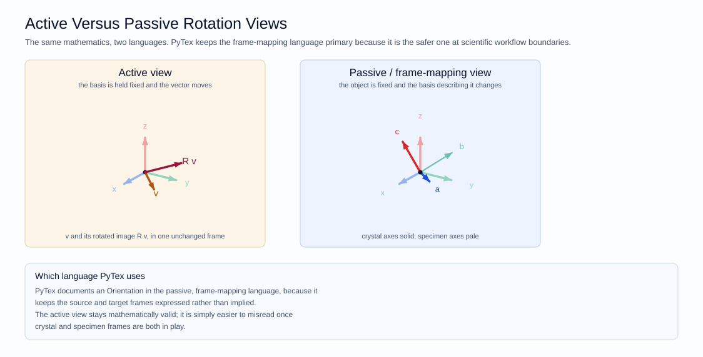
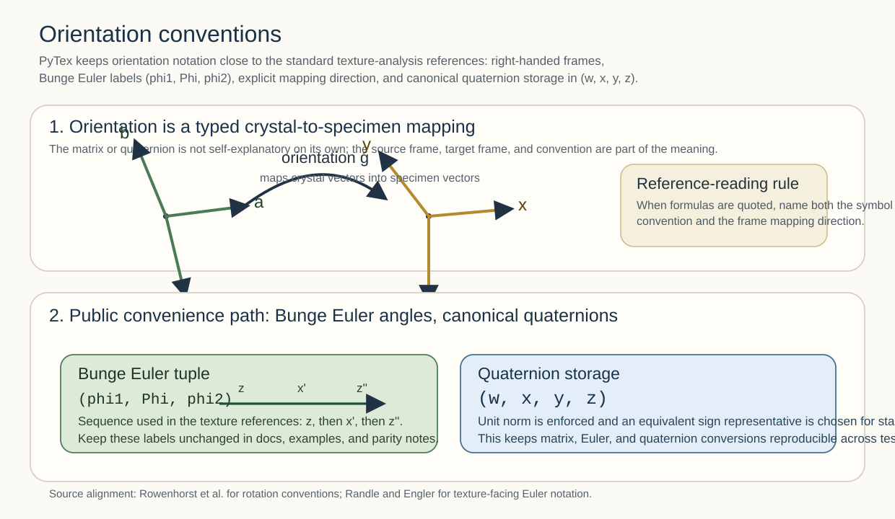
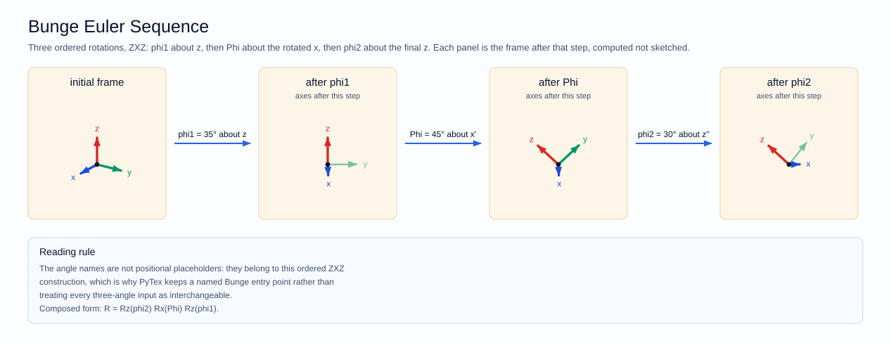
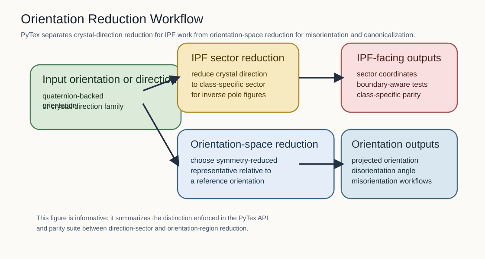

# Reference Frames And Orientation Conventions

This page is the compact reference for how PyTex defines reference-frame semantics and orientation conventions in the stable public API.

## The Core Rule

PyTex does not allow reference-frame meaning to remain implicit. An orientation is not just a rotation matrix or three Euler angles. In the stable model it is an explicitly typed relationship between:

- a crystal-attached frame
- a specimen-attached frame
- a convention-aware rotation representation
- an optional crystal symmetry model

That rule is what makes later EBSD, texture, and diffraction workflows interpretable across modules and tool boundaries.

## Canonical Frame Vocabulary

PyTex uses a shared repository-wide vocabulary for the most important frame domains.


### Crystal Frame

- attached to the phase or lattice
- typically labeled by crystal axes such as `a, b, c`
- the natural home for directions, planes, and symmetry operators

### Specimen Frame

- attached to the sample or macroscopic specimen
- typically labeled by specimen axes such as `x, y, z`
- the target frame for texture and EBSD orientation interpretation

### Map Frame

- attached to scan coordinates
- used for EBSD grid layout and neighbor topology
- not interchangeable with the specimen frame unless a workflow makes that relationship explicit

### Detector Frame

- attached to image or diffraction geometry
- used for pattern formation and projection geometry
- intentionally separate from both crystal and specimen semantics

## How Orientation Is Defined

In PyTex, an `Orientation` represents the rotation that maps the crystal frame into the specimen frame. That is the stable scientific meaning exposed by the public type.

This means:

- orientation objects are not anonymous rotations
- the source and target frames matter
- symmetry reduction is applied relative to the crystal symmetry attached to that orientation

```{note}
PyTex prefers explicit orientation objects over passing raw arrays through the codebase. The point is not ceremony; the point is to avoid silent convention drift.
```


### Direction Of The Mapping

The most common orientation mistake in scientific code is not a numerical bug. It is reversing the meaning of the mapping.

PyTex fixes that directly:

- `Orientation` means crystal frame to specimen frame
- the inverse rotation is not assumed implicitly
- if a workflow needs specimen to crystal behavior, it should request that behavior explicitly rather than silently reinterpret the stored orientation

### Active Vs Passive Language

PyTex documents orientations in a frame-mapping form because that is usually the clearest language at workflow boundaries. A mathematically equivalent active-rotation view also exists, but the docs keep the mapping meaning primary so users are less likely to confuse “rotating a vector” with “changing the frame used to describe it.”



## Euler Angles In PyTex

PyTex supports named Euler convention entry points and keeps the public contract explicit.



### Bunge Euler Angles

The stable convenience path in PyTex is the Bunge convention:

- public helper: `Rotation.from_bunge_euler(phi1, Phi, phi2)`
- public export: `Rotation.to_bunge_euler()`
- general convention-aware entry points also exist through `Rotation.from_euler(..., convention="bunge")`

The intent is that Bunge-facing texture workflows remain readable while the general API still makes convention choice explicit when multiple ecosystems are involved.



#### How To Read The Bunge Sequence

PyTex follows the standard Bunge angle labels `phi1`, `Phi`, and `phi2`. The figure above is a teaching-oriented geometry sketch of the sequence:

- `phi1`: first rotation about the original specimen or laboratory `z` axis
- `Phi`: second rotation about the intermediate line of nodes, usually written as the rotated `x'` axis in the ZXZ sequence
- `phi2`: third rotation about the final crystal-aligned `z''` axis

For users, the main rule is simple: the angle names are not merely positional placeholders. They belong to a specific ordered construction. That is why PyTex keeps the Bunge helper explicit instead of treating all three-angle inputs as interchangeable.

### Matthies And ABG Labels

PyTex also supports:

- `convention="matthies"`
- `convention="abg"`

These are exposed explicitly because cross-tool pipelines often distinguish those labels even when the underlying angle family is closely related.

### Quaternion Storage

Internally, PyTex uses canonical quaternion storage in `(w, x, y, z)` order with unit normalization. Convention-aware Euler import or export exists at the boundary; canonical quaternion representation is the stable internal rotational surface.

## Symmetry Reduction And Fundamental Regions

Euler-angle import is only the first step. Once an orientation exists, PyTex keeps two different reduction problems separate:

- reducing a crystal direction into an inverse-pole-figure sector
- reducing an orientation or misorientation into a symmetry-reduced representative



That distinction matters because IPF-sector reduction and orientation-space reduction are related but not identical mathematical operations.

## The Standard Frame Catalog

You rarely have to build a frame by hand. `pytex.core.frame_catalog` provides the frames every
workflow expects, and they compare equal wherever they appear, so frame identity is stable across
module boundaries.


| Slug | Constant | Domain | Axes |
| --- | --- | --- | --- |
| `cartesian` | `CARTESIAN_FRAME` | laboratory | `X, Y, Z` |
| `specimen` | `SPECIMEN_FRAME` | specimen | `x, y, z` |
| `sample` | `SAMPLE_RD_TD_ND_FRAME` | specimen | `RD, TD, ND` |
| `crystal` | `CRYSTAL_FRAME` | crystal | `a, b, c` |
| `map` | `MAP_FRAME` | map | `x, y, z` |
| `detector` | `DETECTOR_FRAME` | detector | `u, v, n` |
| `laboratory` | `LABORATORY_FRAME` | laboratory | `x_lab, y_lab, z_lab` |

Each slug also has a builder (`sample_frame(...)`, `crystal_frame(...)`, ...) for workflows holding
several frames of the same kind — two phases, two detectors, a parent and a child crystal.

### The Sample Frame

For rolled-sheet work the specimen axes have names a metallurgist expects to read:


## Minimal Example

```python
from pytex import (
    Orientation,
    Rotation,
    SymmetrySpec,
    crystal_frame,
    specimen_frame,
)

crystal = crystal_frame()
specimen = specimen_frame()

symmetry = SymmetrySpec.from_point_group("m-3m", reference_frame=crystal)

orientation = Orientation(
    rotation=Rotation.from_bunge_euler(45.0, 35.0, 15.0),
    crystal_frame=crystal,
    specimen_frame=specimen,
    symmetry=symmetry,
)
```

## Relating Frames

A `FrameTransform` is a typed, invertible map between exactly two named frames, applied as
`v_target = R @ v_source + t`. State the relationship the way you actually know it — most often in
words:

```python
from pytex import FrameTransform, sample_frame, specimen_frame

specimen = specimen_frame()
sample = sample_frame()

transform = FrameTransform.from_axis_correspondence(
    specimen, sample, {"x": "TD", "y": "-RD", "z": "ND"}
)
print(transform.describe())
```

Use `apply_to_directions` for directions, plane normals, and poles — they are translation-invariant,
so an origin offset must not move them — and `apply_to_vectors` for positions.

When a workflow spans several relationships, register them in a `FrameGraph` and ask for the pair
you need; it composes the shortest declared chain for you:

```python
from pytex import rolling_frame_graph

graph = rolling_frame_graph(rd_offset_deg=30.0)
graph.path("cartesian", "sample_rd_td_nd")
# ('cartesian', 'specimen', 'sample_rd_td_nd')
graph.transform_between("cartesian", "sample_rd_td_nd").rotation_angle_deg
# 30.0
```

## Showing The Frame In A Figure

Any 2D figure whose orientation would otherwise be ambiguous can carry a small frame gizmo in a
corner — a SAED diffractogram, a pole figure, an IPF map, a crystal-viewer panel:

```python
from pytex import DETECTOR_FRAME, add_frame_indicator

add_frame_indicator(axes, DETECTOR_FRAME, loc="lower right", label_frame=True)
```

Three renderers already accept it, all opt-in:

```python
plot_saed_pattern(pattern, show_frame_indicator=True)                       # detector u/v
render_composite_saed(pattern, config=CompositeSAEDPlotConfig(show_frame_indicator=True))
plot_crystal_structure_3d(phase, show_frame_indicator=True)                 # crystal a/b/c
```

For documentation assets, `reference_frame_svg` and `frame_catalog_svg` emit complete SVG documents
in pure Python with no matplotlib involved. The figures on this page are generated that way by
`scripts/generate_reference_frame_figures.py`.

## What This Fixes In Practice

- You can tell which way the orientation maps without guessing.
- You can test Euler-angle conversions without losing frame meaning.
- You can perform symmetry-aware misorientation and disorientation calculations on a scientifically explicit object.
- You can connect texture and EBSD workflows without redefining the frame model in each subsystem.
- You can state a vendor axis convention in words instead of hand-writing a permutation matrix.
- You can put the active frame directly into a figure instead of describing it in a caption.

## Related Material

- {doc}`../architecture/reference_frame_foundation`
- {doc}`../architecture/canonical_data_model`
- {doc}`../architecture/orientation_and_texture_foundation`
- [../../tex/theory/reference_frames.tex](../../tex/theory/reference_frames.tex)
- [../../tex/theory/euler_convention_handling.tex](../../tex/theory/euler_convention_handling.tex)
- [../../tex/theory/fundamental_region_reduction.tex](../../tex/theory/fundamental_region_reduction.tex)
- [../../figures/reference_frames_vectors.svg](../../figures/reference_frames_vectors.svg)
- [../../figures/orientation_mapping_semantics.svg](../../figures/orientation_mapping_semantics.svg)
- [../../figures/active_passive_rotation.svg](../../figures/active_passive_rotation.svg)
- [../../figures/bunge_euler_geometry.svg](../../figures/bunge_euler_geometry.svg)
- [../../figures/orientation_conventions.svg](../../figures/orientation_conventions.svg)
- [../../figures/orientation_reduction_workflow.svg](../../figures/orientation_reduction_workflow.svg)

## References

### Normative

- {doc}`../standards/notation_and_conventions`
- {doc}`../architecture/canonical_data_model`
- {doc}`../architecture/orientation_and_texture_foundation`

### Informative

- MTEX documentation: [Definition As Coordinate Transformation](https://mtex-toolbox.github.io/DefinitionAsCoordinateTransform.html)
- MTEX documentation: [Rotation Definition](https://mtex-toolbox.github.io/RotationDefinition.html)
- Bunge, *Texture Analysis in Materials Science* (1982)
