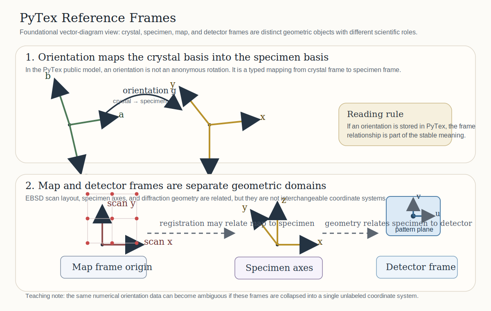
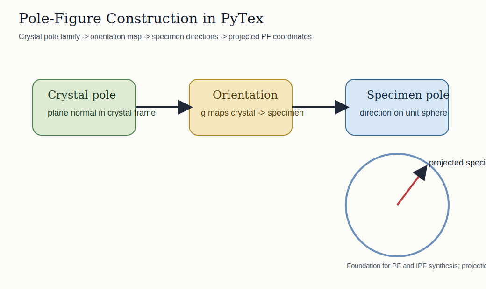

# Technical Glossary And Symbols

This page is the user-facing glossary and symbol guide for PyTex.

It exists to keep terminology, notation, and navigation stable across the documentation system. When a workflow or theory page uses one of these terms or symbols, it should mean the same thing everywhere in the repo.

## Why This Page Exists

- to define major technical terms once
- to fix the main mathematical symbols used across the docs
- to make navigation easier when a page depends on concepts explained elsewhere

For the standards-facing policy behind this page, see {doc}`../standards/terminology_and_symbol_registry`.

## Core Geometry And Frame Terms

### Reference Frame

A named, domain-typed coordinate frame such as crystal, specimen, map, detector, laboratory, or reciprocal.

See also: {doc}`reference_frames_and_conventions`, {doc}`core_model`.

### Crystal Frame

The direct-lattice crystallographic frame attached to the phase and used for crystal directions, planes, and structure semantics.

### Reciprocal Frame

The reciprocal-lattice frame dual to the crystal frame under the PyTex normalization rule $ \mathbf{a}^{*}_i \cdot \mathbf{a}_j = \delta_{ij} $.

### Detector Frame

The frame in which detector coordinates such as $u$ and $v$ live for diffraction geometry and SAED plotting.

See also: {doc}`../workflows/diffraction_geometry`, {doc}`../workflows/saed_generation`.

## Orientation And Texture Terms

### Rotation

A geometric active rotation acting on vectors:

$$
\mathbf{v}' = \mathbf{R}\mathbf{v}.
$$

See also: {doc}`orientation_texture`.

### Orientation

A crystal-to-specimen mapping that wraps a rotation together with explicit frame and symmetry meaning.

### Pole Figure

A distribution of crystal directions or plane normals expressed relative to specimen directions.

See also: {doc}`../workflows/texture_odf_inversion`, {doc}`../workflows/plotting_primitives`.

### Inverse Pole Figure

A distribution of specimen directions expressed in crystal coordinates, commonly reduced into a symmetry-defined sector.

### ODF

Orientation distribution function over orientation space. PyTex now exposes two stable user-facing ODF surfaces: a discrete kernel-supported `ODF` over an explicit orientation support, and a band-limited `HarmonicODF` reconstructed in a symmetry-projected harmonic basis.

See also: {doc}`orientation_texture`, {doc}`../workflows/texture_odf_inversion`.

## Diffraction Terms

### Miller Indices $(hkl)$

Integer triplet identifying a crystal plane or reciprocal-lattice direction in three-index notation.

### Reciprocal-Lattice Vector $\mathbf{g}_{hkl}$

The reciprocal-space vector associated with Miller indices $(hkl)$:

$$
\mathbf{g}_{hkl} = h\mathbf{a}^{*} + k\mathbf{b}^{*} + l\mathbf{c}^{*}.
$$

### Interplanar Spacing $d_{hkl}$

The spacing associated with the $(hkl)$ reflection family:

$$
d_{hkl} = \frac{1}{\lVert \mathbf{g}_{hkl} \rVert}.
$$

### Powder Pattern

A broadened XRD spectrum built from discrete reflections and sampled over a $2\theta$ grid.

See also: {doc}`../workflows/xrd_generation`.

### Zone Axis

A direct-space crystallographic direction defining an electron-diffraction viewing or incidence condition.

### SAED Pattern

A selected-area electron diffraction spot map rendered in detector coordinates from reciprocal-lattice reflections that satisfy a zone-axis condition.

See also: {doc}`../workflows/saed_generation`, {doc}`../workflows/diffraction_spots`.

## Visualization Terms

### Crystal Scene

A reusable geometry bundle containing atoms, bonds, lattice edges, and plane overlays for 3D rendering.

### Plane Overlay

A rendered polygon representing the intersection of a crystallographic plane $(hkl)$ with a repeated unit-cell or supercell box.

### View Direction

A crystallographic direction used to align the 3D camera without changing the underlying crystal geometry.

See also: {doc}`../workflows/crystal_visualization`.

## Core Symbols

| Symbol | Meaning |
| --- | --- |
| $\mathbf{v}$ | Generic vector in an explicitly named frame |
| $\mathbf{R}$ | Rotation matrix |
| $q$ | Unit quaternion |
| $(\phi_1, \Phi, \phi_2)$ | Bunge Euler angles |
| $\mathbf{a}, \mathbf{b}, \mathbf{c}$ | Direct-lattice basis vectors |
| $\mathbf{a}^{*}, \mathbf{b}^{*}, \mathbf{c}^{*}$ | Reciprocal-lattice basis vectors |
| $\mathbf{g}_{hkl}$ | Reciprocal-lattice vector |
| $d_{hkl}$ | Interplanar spacing |
| $\theta$ | Bragg half-angle |
| $2\theta$ | Powder-diffraction scattering angle |
| $F_{hkl}$ | Structure-factor quantity or current proxy |
| $u, v$ | Detector-plane coordinates |
| $\hat{\mathbf{z}}$ | Unit zone-axis direction |

## Related Material

- {doc}`core_model`
- {doc}`reference_frames_and_conventions`
- {doc}`orientation_texture`
- {doc}`../tutorials/installation_and_build`
- {doc}`../theory/index`

## References

### Normative

- {doc}`../standards/terminology_and_symbol_registry`
- {doc}`../standards/notation_and_conventions`

### Informative

- {doc}`../architecture/canonical_data_model`
