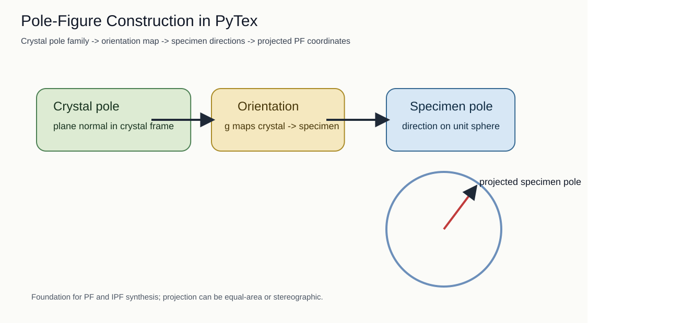

# Technical Glossary And Symbols

This document is the canonical user-facing Grand Technical Glossary and Symbol Guide for PyTex.

It establishes unambiguous physical definitions, governing mathematical equations, variable dimensions, and algorithmic conventions across all scientific domains supported by PyTex: reference frames, diffraction physics, electron microscopy, texture analysis, orientation relationships, microstructural metrics, and crystal mechanics.

Every public surface, workflow, tutorial, and theory note in PyTex conforms to the nomenclature, frame conventions, and symbols defined here.

---

(sec-geometry-and-reference-frames)=
## 1. Geometry and Reference Frames

(term-reference-frame)=
### Reference Frame

A named, domain-typed, right-handed orthogonal Cartesian coordinate system in which physical vectors and tensor fields are expressed. In PyTex, no physical vector is ever represented as a naked array without an explicit reference frame identity.

The canonical coordinate system is defined by an orthonormal basis $(\hat{\mathbf{e}}_1, \hat{\mathbf{e}}_2, \hat{\mathbf{e}}_3)$ satisfying:

$$
\hat{\mathbf{e}}_i \cdot \hat{\mathbf{e}}_j = \delta_{ij}, \quad \hat{\mathbf{e}}_1 \times \hat{\mathbf{e}}_2 = \hat{\mathbf{e}}_3
$$

Where $\delta_{ij}$ is the Kronecker delta.

See also: {doc}`reference_frames_and_conventions`, {doc}`../architecture/reference_frame_foundation`, {doc}`core_model`.

(term-crystal-frame)=
### Crystal Frame

The Cartesian coordinate frame rigidly attached to a crystal lattice phase. By international convention, direct-lattice basis vectors $\mathbf{a}, \mathbf{b}, \mathbf{c}$ are mapped into the crystal Cartesian frame such that $\mathbf{a}$ is aligned along $+X_c$, $\mathbf{b}$ lies in the $X_c-Y_c$ plane with a positive $Y_c$ component, and $\mathbf{c}$ completes the right-handed triad along $+Z_c$:

$$
\mathbf{a} = \begin{pmatrix} a \\ 0 \\ 0 \end{pmatrix}, \quad
\mathbf{b} = \begin{pmatrix} b \cos\gamma \\ b \sin\gamma \\ 0 \end{pmatrix}, \quad
\mathbf{c} = \begin{pmatrix} c \cos\beta \\ c \frac{\cos\alpha - \cos\beta\cos\gamma}{\sin\gamma} \\ \frac{V_c}{a b \sin\gamma} \end{pmatrix}
$$

Where $a, b, c$ are lattice parameters, $\alpha, \beta, \gamma$ are unit cell angles, and $V_c$ is unit cell volume:

$$
V_c = a b c \sqrt{1 - \cos^2\alpha - \cos^2\beta - \cos^2\gamma + 2\cos\alpha\cos\beta\cos\gamma}
$$

Crystal frame axes are designated $a, b, c$ without asterisks.

(term-specimen-frame)=
### Specimen Frame and Sample Frame

The macroscopic Cartesian coordinate frame attached to the workpiece or physical sample. In sheet metal and flat products, the specimen frame is conventionally designated the **sample frame** with axes:

- $\mathrm{RD}$: Rolling Direction ($+X_s$)
- $\mathrm{TD}$: Transverse Direction ($+Y_s$)
- $\mathrm{ND}$: Normal Direction ($+Z_s$, sheet normal)

Forming an orthonormal right-handed triad: $\mathrm{RD} \times \mathrm{TD} = \mathrm{ND}$.

See also: {doc}`reference_frames_and_conventions`.

(term-reciprocal-frame)=
### Reciprocal Frame

The dual basis frame describing reciprocal space. In PyTex, the reciprocal lattice basis vectors $\mathbf{a}^*, \mathbf{b}^*, \mathbf{c}^*$ are normalized according to the crystallographic convention:

$$
\mathbf{a}^*_i \cdot \mathbf{a}_j = \delta_{ij}
$$

Explicitly:

$$
\mathbf{a}^* = \frac{\mathbf{b} \times \mathbf{c}}{V_c}, \quad
\mathbf{b}^* = \frac{\mathbf{c} \times \mathbf{a}}{V_c}, \quad
\mathbf{c}^* = \frac{\mathbf{a} \times \mathbf{b}}{V_c}
$$

Under this normalization, the magnitude of a reciprocal lattice vector $\mathbf{g}_{hkl}$ is identically the reciprocal of the interplanar spacing: $\lVert\mathbf{g}_{hkl}\rVert = 1 / d_{hkl}$ (expressed in $\text{\AA}^{-1}$).

**The Reciprocal Star Rule:** The asterisk ($*$) belongs strictly to the **basis vectors** ($\mathbf{a}^*, \mathbf{b}^*, \mathbf{c}^*$) and the reciprocal metric tensor ($\mathbf{G}^*$). It is never attached to Miller indices $(hkl)$, which are already scalar components on the reciprocal basis.

(term-detector-frame)=
### Detector Frame

The 2D/3D coordinate system attached to a planar detector or phosphor screen (used in SAED, CBED, and EBSD). Detector coordinates $(u, v)$ represent physical coordinates (in millimetres or pixels) on the detector plane, with the normal $\hat{\mathbf{n}}$ directed towards or away from the sample.

See also: {doc}`../workflows/diffraction_geometry`, {doc}`../workflows/saed_generation`.

(term-laboratory-frame)=
### Laboratory Frame

The fixed, stationary spatial coordinate system $(X_L, Y_L, Z_L)$ of the instrument. In a transmission electron microscope (TEM), $+Z_L$ typically points along the optical axis opposite to the electron beam propagation direction. In an X-ray diffractometer, the laboratory frame is anchored to the goniometer rotation axes.

(term-holder-frame)=
### Holder Frame

The physical reference frame attached to the specimen holder or goniometer stage in a TEM. The holder frame rotates relative to the laboratory frame through physical stage tilts ($\alpha$ about the holder rod axis and $\beta$ about the tilt cradle axis). At zero stage tilts ($\alpha = 0, \beta = 0$), the holder frame coincides with the laboratory frame.

See also: {doc}`../algorithms/tem_tilt_navigation`, {doc}`../workflows/workbench_application`.

---

(sec-index-notation-and-metric)=
## 2. Index Notation and Metric Tensors

(term-index-notation)=
### Index Notation and Symmetry Families

| Quantity | Specific Member | Symmetry-Related Family | Coordinate System |
| :--- | :--- | :--- | :--- |
| Lattice plane | $(hkl)$ | $\{hkl\}$ | Reciprocal basis $\mathbf{a}^*, \mathbf{b}^*, \mathbf{c}^*$ |
| Lattice direction | $[uvw]$ | $\langle uvw \rangle$ | Direct basis $\mathbf{a}, \mathbf{b}, \mathbf{c}$ |
| Hexagonal plane | $(hkil)$ | $\{hkil\}$ | Miller-Bravais reciprocal basis ($i = -(h+k)$) |
| Hexagonal direction | $[uvtw]$ | $\langle uvtw \rangle$ | Weber direct basis ($t = -(u+v)$) |

A specific plane $(hkl)$ or direction $[uvw]$ denotes an individual crystallographic feature. A bracketed family $\{hkl\}$ or $\langle uvw \rangle$ denotes the full crystallographic orbit generated by the point-group symmetry operations of the phase.

In publication-facing prose and rendering, negative indices are rendered with an overbar ($\bar{1}$) rather than a minus sign.

(term-reciprocal-lattice-vector)=
### Reciprocal Lattice Vector $\mathbf{g}_{hkl}$

The vector in reciprocal space connecting the reciprocal lattice origin to the node indexed by integers $(hkl)$:

$$
\mathbf{g}_{hkl} = h\mathbf{a}^* + k\mathbf{b}^* + l\mathbf{c}^*
$$

The vector $\mathbf{g}_{hkl}$ is normal to the crystallographic planes $(hkl)$ in direct space, and its Euclidean length is:

$$
\lVert \mathbf{g}_{hkl} \rVert = \sqrt{\mathbf{g}_{hkl} \cdot \mathbf{g}_{hkl}} = \frac{1}{d_{hkl}}
$$

(term-interplanar-spacing)=
### Interplanar Spacing $d_{hkl}$

The perpendicular distance between adjacent parallel lattice planes of the family $\{hkl\}$:

$$
d_{hkl} = \frac{1}{\lVert \mathbf{g}_{hkl} \rVert} = \frac{1}{\sqrt{\mathbf{h}^\mathsf{T} \mathbf{G}^* \mathbf{h}}}
$$

Where $\mathbf{h} = (h, k, l)^\mathsf{T}$ is the integer index column vector and $\mathbf{G}^*$ is the reciprocal metric tensor.

(term-metric-tensor)=
### Metric Tensors ($\mathbf{G}$ and $\mathbf{G}^*$)

The direct metric tensor $\mathbf{G}$ is the $3 \times 3$ matrix of scalar products of the direct basis vectors:

$$
G_{ij} = \mathbf{a}_i \cdot \mathbf{a}_j = \begin{pmatrix}
a^2 & ab\cos\gamma & ac\cos\beta \\
ab\cos\gamma & b^2 & bc\cos\alpha \\
ac\cos\beta & bc\cos\alpha & c^2
\end{pmatrix}
$$

The reciprocal metric tensor $\mathbf{G}^*$ is the matrix of scalar products of the reciprocal basis vectors:

$$
G^*_{ij} = \mathbf{a}^*_i \cdot \mathbf{a}^*_j = (\mathbf{G}^{-1})_{ij}
$$

The scalar product of two direct vectors $\mathbf{u}, \mathbf{v}$ is $\mathbf{u}^\mathsf{T}\mathbf{G}\mathbf{v}$. The scalar product of two reciprocal vectors $\mathbf{h}_1, \mathbf{h}_2$ is $\mathbf{h}_1^\mathsf{T}\mathbf{G}^*\mathbf{h}_2$.

(term-zone-law)=
### Weiss Zone Law

A crystallographic direction $[uvw]$ lies within a plane $(hkl)$ if and only if their scalar product vanishes:

$$
h u + k v + l w = 0
$$

In vector notation: $\mathbf{g}_{hkl} \cdot \mathbf{r}_{uvw} = 0$. The direction $[uvw]$ is then the **zone axis** for all planes $(hkl)$ satisfying this condition.

---

(sec-diffraction-physics)=
## 3. Diffraction Physics, Scattering, and TEM Metrology

(term-excitation-error)=
### Excitation Error ($s_g$ or $s$) and Deviation Parameter

The excitation error $s_g$ (also called the deviation parameter) measures the signed distance in reciprocal space from a reciprocal lattice point $\mathbf{g}$ to the Ewald sphere. It quantifies how far a lattice plane is from the exact Bragg diffraction condition.

#### Mathematical Formulation

Let $\mathbf{k}_0$ denote the incident electron wavevector ($|\mathbf{k}_0| = 1/\lambda$) and $\mathbf{k}$ denote the elastically scattered wavevector on the Ewald sphere ($|\mathbf{k}| = 1/\lambda$). In three-dimensional reciprocal space, the deviation vector $\mathbf{s}_g$ is defined by:

$$
\mathbf{k} = \mathbf{k}_0 + \mathbf{g} + \mathbf{s}_g
$$

By convention in transmission electron microscopy (Hirsch et al., Williams & Carter), $\mathbf{s}_g$ is taken parallel to the incident beam direction (or parallel to the specimen foil normal $\hat{\mathbf{n}}$). Taking the beam along $-\hat{\mathbf{z}}$ and projecting along the zone axis, the scalar excitation error $s_g$ satisfies:

$$
s_g = g_z - \frac{\lambda \lVert \mathbf{g} \rVert^2}{2}
$$

Where:
- $g_z = \mathbf{g} \cdot \hat{\mathbf{z}}$ is the component of $\mathbf{g}$ parallel to the zone axis (in $\text{\AA}^{-1}$). For reflections in the Zero-Order Laue Zone (ZOLZ), $g_z = 0$.
- $\lambda$ is the relativistic electron wavelength (in $\text{\AA}$).
- $\lVert\mathbf{g}\rVert = 1/d_{hkl}$ is the magnitude of the reciprocal lattice vector (in $\text{\AA}^{-1}$).

When a specimen is tilted by an angle vector $\boldsymbol{\theta} = (\theta_x, \theta_y)$ relative to the zone axis, the excitation error varies linearly with the in-plane tilt:

$$
s_g(\boldsymbol{\theta}) = g_z + \boldsymbol{\theta} \cdot \mathbf{g}_\perp - \frac{\lambda \lVert \mathbf{g} \rVert^2}{2}
$$

Where $\mathbf{g}_\perp = (g_x, g_y)$ is the in-plane projection of $\mathbf{g}$.

#### Physical Significance and Sign Convention

- **$s_g = 0$ (Exact Bragg condition):** The reciprocal lattice node lies exactly on the Ewald sphere. Diffraction intensity is maximized.
- **$s_g > 0$:** The reciprocal lattice node lies **outside** the Ewald sphere. In dark-field TEM, tilting towards positive $s_g$ shifts Kikuchi lines outside the diffraction spot.
- **$s_g < 0$:** The reciprocal lattice node lies **inside** the Ewald sphere. For a flat ZOLZ plane ($g_z = 0$), all reflections have $s_g = -\lambda\lVert\mathbf{g}\rVert^2 / 2 \le 0$ because the curved Ewald sphere curves away from the planar reciprocal lattice layer.

Because thin foil specimens produce elongated relrods of finite length $\sim 1/t$, diffraction spots do not abruptly vanish when $s_g \neq 0$; instead, their intensity decreases according to the relrod shape factor.

See also: {doc}`../algorithms/composite_saed_assembly`, {doc}`../workflows/composite_or_diffraction`, {doc}`../workflows/diffraction_spots`, {doc}`../theory/reciprocal_space_and_kinematic_spots`.

(term-extinction-distance)=
### Extinction Distance ($\xi_g$)

The characteristic spatial period over which diffracted electron beam energy oscillates between the forward-transmitted beam ($\mathbf{0}$) and the diffracted beam ($\mathbf{g}$) in two-beam dynamical diffraction theory (the Pendellösung effect).

#### Mathematical Formulation

In a parallel crystal slab of thickness $t$, the two-beam extinction distance is:

$$
\xi_g = \frac{\pi V_c \cos\theta_B}{\lambda |F_g|}
$$

Where:
- $V_c$ is the crystal unit cell volume ($\text{\AA}^3$).
- $\lambda$ is the relativistic electron wavelength ($\text{\AA}$).
- $\theta_B = \arcsin(\lambda / 2d)$ is the Bragg angle ($\text{rad}$). Because $\theta_B$ is typically very small ($< 1^\circ$) for high-energy electrons, $\cos\theta_B \approx 1$.
- $|F_g|$ is the crystal structure factor for electron scattering ($\text{\AA}$), calculated from relativistic atomic scattering factors $f_e(s)$.

#### Two-Beam Rocking Curve and Effective Extinction Distance

When the crystal deviates from the exact Bragg condition ($s_g \neq 0$), the oscillation depth shortens to the **effective extinction distance** $\xi_g^*$:

$$
\xi_g^* = \frac{\xi_g}{\sqrt{1 + (s_g \xi_g)^2}}
$$

The corresponding effective excitation error is $s_{\mathrm{eff}} = \sqrt{s_g^2 + \xi_g^{-2}} = 1/\xi_g^*$.

The diffracted beam intensity as a function of foil thickness $t$ and excitation error $s_g$ is given by the Howie–Whelan solution:

$$
I_g(t, s_g) = \frac{1}{1 + (s_g \xi_g)^2} \sin^2\left(\pi t \sqrt{s_g^2 + \xi_g^{-2}}\right) = \left(\frac{\pi}{\xi_g}\right)^2 \frac{\sin^2(\pi t s_{\mathrm{eff}})}{(\pi s_{\mathrm{eff}})^2}
$$

In the kinematic limit ($t \ll \xi_g$ or $s_g \xi_g \gg 1$), this smoothly converges to the kinematic shape factor $I_g \propto \operatorname{sinc}^2(\pi t s_g)$.

See also: {doc}`../algorithms/cbed_thickness_and_symmetry`, {doc}`../theory/dynamical_cbed_and_symmetry_determination`.

(term-ewald-sphere)=
### Ewald Sphere

A geometric construction in reciprocal space that represents the conservation of energy and momentum during elastic scattering.

A sphere of radius $k = 1/\lambda$ is constructed with its center at $-\mathbf{k}_0$ relative to the reciprocal lattice origin $\mathbf{0}$. The incident wavevector $\mathbf{k}_0$ connects the sphere center to the origin $\mathbf{0}$. An elastic diffraction condition is satisfied whenever any reciprocal lattice node $\mathbf{g}$ intersects the surface of the sphere, such that:

$$
\lVert \mathbf{k} \rVert = \lVert \mathbf{k}_0 + \mathbf{g} \rVert = \frac{1}{\lambda}
$$

For 200 kV electrons ($\lambda = 0.02508\ \text{\AA}$), the Ewald sphere radius is $k \approx 39.87\ \text{\AA}^{-1}$—vastly larger than typical reciprocal lattice spacings ($|\mathbf{g}| \sim 0.2 - 1.5\ \text{\AA}^{-1}$). Consequently, the Ewald sphere is nearly flat across the first few reciprocal lattice zones, allowing multiple diffraction spots to be observed simultaneously in a TEM selected-area diffraction pattern.

(term-relrod)=
### Relrod (Reciprocal Lattice Rod) and Shape Factor $S_t(s_g)$

In an infinite, ideal crystal, reciprocal lattice nodes are infinitesimally small Dirac delta points $\delta(\mathbf{r}^* - \mathbf{g})$. In a thin transmission electron microscopy foil of finite thickness $t$ along the beam normal, the reciprocal lattice nodes are elongated into rods perpendicular to the foil surface, termed **relrods**.

The reciprocal-space amplitude distribution around each node is the Fourier transform of the finite specimen shape function:

$$
S_t(s_g) = \frac{\sin(\pi t s_g)}{\pi t s_g} = \operatorname{sinc}(\pi t s_g)
$$

The kinematic intensity across the relrod varies as:

$$
I(s_g) \propto |S_t(s_g)|^2 = \left(\frac{\sin(\pi t s_g)}{\pi t s_g}\right)^2
$$

The central relrod maximum occurs at $s_g = 0$ with value $1.0$, and the intensity drops to zero at relrod nodes:

$$
s_g = \pm \frac{m}{t}, \quad m \in \{1, 2, 3, \dots\}
$$

The thinner the foil, the longer the relrod ($\Delta s_g \sim 2/t$), allowing reflections with substantial excitation error to produce visible diffraction spots.

See also: {doc}`../algorithms/composite_saed_assembly`, {doc}`../workflows/saed_generation`.

(term-holz)=
### Higher-Order Laue Zones (HOLZ) and HOLZ Lines

The planes of the reciprocal lattice perpendicular to a direct-space zone axis $\mathbf{u}_{uvw}$ occur at discrete, equally spaced parallel layers $g_z = n H$, where $n$ is an integer:

- $n = 0$: **Zero-Order Laue Zone (ZOLZ)**, passing through the origin $\mathbf{0}$.
- $n = 1$: **First-Order Laue Zone (FOLZ)**.
- $n = 2$: **Second-Order Laue Zone (SOLZ)**.

The layer repeat spacing $H$ along the zone axis is the reciprocal of the direct-lattice repeat distance:

$$
H = \frac{1}{\lVert \mathbf{u}_{uvw} \rVert}
$$

Because the Ewald sphere is curved with radius $1/\lambda$, it curves upward away from the ZOLZ plane and intersects the $n$-th HOLZ plane in a ring of reciprocal radius:

$$
G_n = \sqrt{\left(\frac{1}{\lambda}\right)^2 - \left(\frac{1}{\lambda} - nH\right)^2} = \sqrt{\frac{2 n H}{\lambda} - n^2 H^2} \approx \sqrt{\frac{2 n H}{\lambda}}
$$

#### HOLZ Deficiency Lines and Strain Metrology

In convergent-beam electron diffraction (CBED), electrons incident at the exact Bragg angle of a high-index HOLZ reflection are scattered out of the central transmitted disc into the HOLZ ring. This produces sharp, dark **HOLZ deficiency lines** inside the central bright-field disc.

Because HOLZ reflections have large scattering vectors $|\mathbf{g}|$ and small interplanar spacings $d$, the geometric positions of HOLZ deficiency lines are extraordinarily sensitive to minute changes in unit cell parameters ($a, b, c, \alpha, \beta, \gamma$) and elastic strain:

$$
\frac{\Delta d}{d} = -\frac{\Delta \lambda}{\lambda}
$$

PyTex exploits this geometric sensitivity for local lattice parameter and strain tensor determination.

See also: {doc}`../algorithms/cbed_thickness_and_symmetry`, {doc}`../theory/dynamical_cbed_and_symmetry_determination`.

(term-double-diffraction)=
### Double Diffraction

A dynamical multiple-scattering phenomenon in which an electron beam strongly diffracted by reciprocal lattice vector $\mathbf{g}_1$ acts as a secondary incident beam inside the crystal and undergoes a second Bragg diffraction by vector $\mathbf{g}_2$.

The net scattering vector of the doubly diffracted beam is:

$$
\mathbf{g} = \mathbf{g}_1 + \mathbf{g}_2
$$

#### Physical Consequences: Revival of Kinematically Forbidden Reflections

If both $\mathbf{g}_1$ and $\mathbf{g}_2$ are strongly excited allowed reflections, intensity will appear at $\mathbf{g} = \mathbf{g}_1 + \mathbf{g}_2$ even if the kinematic structure factor $F(\mathbf{g})$ is identically zero due to screw axis or glide plane extinction rules (e.g., the forbidden $\{002\}$ reflection in silicon or diamond along the $\langle 110 \rangle$ zone axis, produced by $(1\bar{1}1) + (\bar{1}11) = (002)$).

**Centering Absences Are Invariant:** Centering absences (such as $h+k+l = \text{odd}$ in body-centered cubic or mixed-parity indices in face-centered cubic) can **never** be revived by double diffraction, because the centering translation operations form a group that closes under vector addition: if $\mathbf{g}_1, \mathbf{g}_2 \in \Lambda_{\text{allowed}}$, then $\mathbf{g}_1 + \mathbf{g}_2 \in \Lambda_{\text{allowed}}$.

See also: {doc}`../theory/reciprocal_space_and_kinematic_spots`, {doc}`../workflows/saed_generation`.

(term-camera-constant)=
### Camera Constant ($\Lambda = L\lambda$)

The fundamental calibration constant in transmission electron diffraction relating radial spot displacement $R$ on a flat detector to interplanar spacing $d$ and reciprocal lattice vector length $\lVert\mathbf{g}\rVert$.

By Bragg's law in the small-angle approximation ($\tan 2\theta_B \approx 2\theta_B \approx \lambda / d$):

$$
R = L \tan 2\theta_B \approx L \frac{\lambda}{d} = (L \lambda) \lVert \mathbf{g} \rVert = \Lambda \lVert \mathbf{g} \rVert
$$

Where:
- $L$ is the effective microscope camera length (in $\text{mm}$).
- $\lambda$ is the relativistic electron wavelength (in $\text{\AA}$).
- $\Lambda = L\lambda$ is the **camera constant** (in $\text{mm}\cdot\text{\AA}$).
- $R$ is the measured radial distance from the unscattered beam center (in $\text{mm}$).
- $d$ is the interplanar spacing (in $\text{\AA}$).

See also: {doc}`../algorithms/saed_pattern_indexing`, {doc}`../workflows/tem_pattern_indexing`.

(term-kikuchi-bands)=
### Kikuchi Bands, Kikuchi Lines, and Kossel Cones

Diffraction features formed in electron backscatter diffraction (EBSD) and thick-specimen TEM by incoherently (inelastically) scattered electrons undergoing subsequent elastic Bragg diffraction.

Inelastic phonon and plasmon scattering creates an isotropic source of electrons within the crystal. For any family of planes $(hkl)$, electrons travelling at the Bragg angle $\theta_B$ relative to the planes satisfy the Bragg condition and are diffracted. This generates two **Kossel cones** of semi-angle $90^\circ - \theta_B$ centered on the plane normal $\mathbf{n}_{hkl}$.

The intersection of these two cones with a flat screen produces a pair of hyperbolic lines—the **Kikuchi lines**—separated by an angular width of:

$$
\Delta\theta_{\mathrm{band}} = 2\theta_B \approx \frac{\lambda}{d_{hkl}}
$$

The region between the lines is the **Kikuchi band**. On a detector at camera distance $L$, the linear band width is:

$$
w_{\mathrm{band}} \approx L \frac{\lambda}{d_{hkl}} = \frac{\Lambda}{d_{hkl}} = \Lambda \lVert \mathbf{g}_{hkl} \rVert
$$

Consequently, high-index planes with small $d$-spacings produce wide Kikuchi bands, while low-index planes produce narrower, more intense bands. The intersection of multiple Kikuchi bands identifies direct-space zone axes.

See also: {doc}`../algorithms/kikuchi_band_geometry`, {doc}`../workflows/kikuchi_geometry`, {doc}`../theory/kikuchi_bands_and_gnomonic_projection`.

(term-gnomonic-projection)=
### Gnomonic Projection

The central perspective projection that maps points on a sphere from the sphere's center onto a flat tangent detector plane. It is the natural coordinate projection for electron backscatter diffraction (EBSD) patterns.

A direction on the unit sphere $(\sin\theta\cos\phi, \sin\theta\sin\phi, \cos\theta)$ is projected onto a flat screen located at distance $D$ along $+Z$:

$$
x_d = D \tan\theta \cos\phi, \quad y_d = D \tan\theta \sin\phi
$$

Under gnomonic projection:
- Every great circle (the trace of a crystal plane passing through the origin) projects as an exact **straight line**.
- Kossel cones project as conic sections (hyperbolas that closely approximate straight parallel lines for small Bragg angles).

See also: {doc}`../algorithms/kikuchi_band_geometry`, {doc}`../theory/kikuchi_bands_and_gnomonic_projection`.

(term-mott-bethe)=
### Mott–Bethe Formula

The relationship connecting electron atomic scattering factors $f_e(s)$ to X-ray atomic scattering factors $f_X(s)$, reflecting the fact that electrons scatter from the total electrostatic potential of both atomic nucleus and electron cloud, whereas X-rays scatter exclusively from electron density.

$$
f_e(s) = \frac{m_0 e^2}{8\pi \epsilon_0 h^2} \frac{Z - f_X(s)}{s^2} = \frac{1}{8\pi^2 a_0} \frac{Z - f_X(s)}{s^2}
$$

Where:
- $s = \sin\theta / \lambda = \lVert\mathbf{g}\rVert / 2$ is the scattering parameter ($\text{\AA}^{-1}$).
- $Z$ is the atomic number.
- $f_X(s)$ is the X-ray atomic form factor (in electron units).
- $a_0 = \frac{4\pi\epsilon_0 \hbar^2}{m_0 e^2} \approx 0.529177\ \text{\AA}$ is the Bohr radius.
- The numerical prefactor is $\frac{1}{8\pi^2 a_0} \approx 0.0239337\ \text{\AA}^{-1}$.

At forward scattering angles ($s \to 0$), the Mott–Bethe formula converges via L'Hôpital's rule to the mean-square atomic radius: $f_e(0) = \frac{1}{6 a_0} Z \langle r^2 \rangle$.

(term-caglioti)=
### Caglioti Resolution Function

The semi-empirical quadratic relationship parameterizing the instrument-induced peak full width at half maximum (FWHM, $H_k$) as a function of Bragg angle $\theta$ in powder X-ray and neutron diffraction:

$$
H_k^2(\theta) = U \tan^2\theta + V \tan\theta + W
$$

Where $U, V, W$ are instrument-specific Caglioti parameters refined during whole-pattern Le Bail and Rietveld refinements.

See also: {doc}`../algorithms/precise_lattice_parameter_determination`, {doc}`../algorithms/rietveld_refinement`.

(term-cbed)=
### Convergent-Beam Electron Diffraction (CBED) Disc Geometry

In CBED, the electron beam is focused into a convergent cone of semi-angle $\alpha$ at the specimen. Instead of discrete diffraction points, the diffraction pattern consists of circular discs of radius:

$$
R_{\mathrm{disc}} = L \alpha
$$

In reciprocal space, the disc radius is $\alpha / \lambda$.

#### Kossel–Möllenstedt Regime

Adjacent diffraction discs remain non-overlapping when the convergence semi-angle $\alpha$ does not exceed the Bragg angle $\theta_B$ of the closest low-index reflection:

$$
2\alpha \le 2\theta_B \approx \frac{\lambda}{d_{\min}} \iff R_{\mathrm{disc}} \le \frac{1}{2} R_{\mathbf{g}}
$$

This is the **Kossel–Möllenstedt** condition. When $2\alpha > 2\theta_B$, discs overlap and produce coherent interferometric Ronchigram fringes.

See also: {doc}`../algorithms/cbed_thickness_and_symmetry`, {doc}`../theory/dynamical_cbed_and_symmetry_determination`.

---

(sec-texture-and-orientation)=
## 4. Texture, Orientation Space, and Harmonic Analysis

(term-odf)=
### Orientation Distribution Function (ODF, $f(g)$)

The continuous probability density function defining the crystallographic texture of a polycrystalline material. It gives the volume fraction $\mathrm{d}V / V$ of crystallites whose orientation lies within an infinitesimal orientation volume element $\mathrm{d}g$ around rotation $g \in \mathrm{SO}(3)$:

$$
\frac{\mathrm{d}V}{V} = f(g) \, \mathrm{d}g
$$

Normalized such that the integral over orientation space equals unity:

$$
\oint_{\mathrm{SO}(3)} f(g) \, \mathrm{d}g = 1
$$

In a generalized spherical harmonic basis with sample and crystal point-group symmetries:

$$
f(g) = 1 + \sum_{l=1}^{L_{\max}} \sum_{\mu=1}^{M(l)} \sum_{\nu=1}^{N(l)} C_l^{\mu\nu} \, \dot{\ddot{T}}_l^{\mu\nu}(g)
$$

Where $C_l^{\mu\nu}$ are harmonic expansion coefficients and $\dot{\ddot{T}}_l^{\mu\nu}(g)$ are symmetrized generalized spherical harmonic basis functions of degree $l$.

See also: {doc}`orientation_texture`, {doc}`../workflows/texture_odf_inversion`, {doc}`../workflows/harmonic_odf_reconstruction`.

(term-mrd)=
### Multiples of a Random Distribution (m.r.d.)

The standard dimensionless unit of texture density for pole figures and ODFs.

A completely untextured (randomly oriented) polycrystal exhibits a constant texture density of identically $1.0\ \text{m.r.d.}$ across all orientations and directions:

$$
f_{\mathrm{random}}(g) \equiv 1.0\ \text{m.r.d.}, \quad P_{\mathbf{h},\mathrm{random}}(\mathbf{y}) \equiv 1.0\ \text{m.r.d.}
$$

Values $> 1.0\ \text{m.r.d.}$ represent preferred crystallographic orientations; values $< 1.0\ \text{m.r.d.}$ represent texture depletion.

See also: {doc}`../theory/pole_figure_arithmetic_and_mrd`.

(term-pole-figure)=
### Pole Figure ($P_{\mathbf{h}}(\mathbf{y})$)

The two-dimensional stereographic or equal-area projection showing the distribution of specimen directions $\mathbf{y}$ parallel to a specific crystal plane normal $\mathbf{h} = \{hkl\}$:

$$
P_{\mathbf{h}}(\mathbf{y}) = \frac{1}{2\pi} \int_{\mathbf{h} \parallel \mathbf{y}} f(g) \, \mathrm{d}\psi
$$

Where the line integral is taken over all rotations about the direction $\mathbf{h} \parallel \mathbf{y}$. Pole figures are normalized to unity over the unit sphere $S^2$:

$$
\frac{1}{4\pi} \oint_{S^2} P_{\mathbf{h}}(\mathbf{y}) \, \mathrm{d}\mathbf{y} = 1.0\ \text{m.r.d.}
$$

See also: {doc}`../workflows/pole_figure_presentation`, {doc}`../algorithms/pole_figure_inversion`.

(term-inverse-pole-figure)=
### Inverse Pole Figure (IPF, $R_{\mathbf{y}}(\mathbf{h})$)

The distribution of crystallographic plane normals $\mathbf{h}$ aligned with a nominated macroscopic specimen direction $\mathbf{y}$ (such as $\mathrm{ND}$, $\mathrm{RD}$, or $\mathrm{TD}$):

$$
R_{\mathbf{y}}(\mathbf{h}) = \frac{1}{2\pi} \int_{\mathbf{h} \parallel \mathbf{y}} f(g) \, \mathrm{d}\psi'
$$

Conventionally plotted within the **standard stereographic triangle** (fundamental sector) of the crystal point group.

See also: {doc}`../algorithms/ipf_coloring`, {doc}`../workflows/ipf_colors`.

(term-ghost-problem)=
### Ghost Problem and Odd-Degree Harmonics

In laboratory X-ray and neutron diffraction, diffraction pole figures satisfy Friedel's law ($I_{\mathbf{h}} = I_{-\mathbf{h}}$), introducing an inversion center:

$$
P_{\mathbf{h}}(\mathbf{y}) = P_{-\mathbf{h}}(\mathbf{y})
$$

Because spherical harmonics of odd degree $l$ change sign under inversion ($Y_l^m(-\mathbf{y}) = (-1)^l Y_l^m(\mathbf{y})$), all odd-degree harmonic coefficients ($l = 1, 3, 5, \dots$) integrate identically to zero in the pole figure projection:

$$
\tilde{C}_l^{\mu\nu} = \frac{1 + (-1)^l}{2} C_l^{\mu\nu} = \begin{cases} C_l^{\mu\nu}, & l \text{ even} \\ 0, & l \text{ odd} \end{cases}
$$

Direct inversion of experimental pole figures without non-negativity constraints recovers only the even-degree part of the ODF ($f_{\mathrm{even}}(g)$), omitting nearly half the series. The missing odd harmonics cause severe truncation oscillations, producing unphysical negative densities and spurious artificial peaks ("ghosts"). PyTex solves this problem via non-negativity constrained optimization ($f(g) \ge 0$) and discrete exponential components.

See also: {doc}`../algorithms/ghost_correction`, {doc}`../theory/ghost_problem_and_odd_harmonics`.

(term-kearns-parameter)=
### Kearns Parameter ($f_i$) and Basal Pole Orientation Tensor ($\mathbf{A}$)

The Kearns orientation parameter $f_i$ represents the effective volume fraction of hexagonal close-packed (HCP) basal poles $[0001]$ aligned along a principal macroscopic specimen direction $\mathbf{d}_i$ ($i \in \{\mathrm{RD}, \mathrm{TD}, \mathrm{ND}\}$):

$$
f_i = \langle \cos^2\phi_i \rangle = \frac{\int_0^{\pi/2} I(\phi_i) \cos^2\phi_i \sin\phi_i \, \mathrm{d}\phi_i}{\int_0^{\pi/2} I(\phi_i) \sin\phi_i \, \mathrm{d}\phi_i}
$$

Where $\phi_i$ is the tilt angle of the basal pole away from axis $\mathbf{d}_i$, and $I(\phi_i)$ is the azimuthally integrated basal pole intensity profile.

#### The Basal Orientation Tensor $\mathbf{A}$

In PyTex, the Kearns parameter is generalized as the quadratic form of the second-moment orientation tensor $\mathbf{A} = \langle \mathbf{c}\mathbf{c}^\mathsf{T} \rangle$:

$$
f(\mathbf{d}) = \mathbf{d}^\mathsf{T} \mathbf{A} \mathbf{d}, \quad \mathbf{A} = \frac{1}{V} \int_{\mathrm{SO}(3)} f(g) \, (\mathbf{R}_g \hat{\mathbf{c}}) (\mathbf{R}_g \hat{\mathbf{c}})^\mathsf{T} \, \mathrm{d}g
$$

Because $\mathbf{c}$ is a unit vector, $\operatorname{tr}(\mathbf{A}) = 1$. Consequently, the Kearns parameters along any three mutually orthogonal specimen axes satisfy the exact invariant sum rule:

$$
f_{\mathrm{RD}} + f_{\mathrm{TD}} + f_{\mathrm{ND}} = 1.0
$$

For an isotropic (random) texture, $f_{\mathrm{RD}} = f_{\mathrm{TD}} = f_{\mathrm{ND}} = 1/3 \approx 0.3333$.

See also: {doc}`../algorithms/kearns_parameter`, {doc}`../theory/kearns_parameter_and_basal_pole_texture`.

(term-bunge-euler)=
### Bunge Euler Angles $(\phi_1, \Phi, \phi_2)$

The standard $Z-X'-Z''$ passive rotation sequence parameterizing an orientation $g \in \mathrm{SO}(3)$ mapping specimen-frame vectors into crystal-frame components:

1. Rotation by $\phi_1 \in [0, 2\pi)$ about the initial specimen $+Z_s$ axis.
2. Rotation by $\Phi \in [0, \pi]$ about the intermediate $+X'$ axis.
3. Rotation by $\phi_2 \in [0, 2\pi)$ about the final $+Z''$ axis.

The resulting rotation matrix is:

$$
\mathbf{g}(\phi_1, \Phi, \phi_2) = \begin{pmatrix}
\cos\phi_1\cos\phi_2 - \sin\phi_1\sin\phi_2\cos\Phi & \sin\phi_1\cos\phi_2 + \cos\phi_1\sin\phi_2\cos\Phi & \sin\phi_2\sin\Phi \\
-\cos\phi_1\sin\phi_2 - \sin\phi_1\cos\phi_2\cos\Phi & -\sin\phi_1\sin\phi_2 + \cos\phi_1\cos\phi_2\cos\Phi & \cos\phi_2\sin\Phi \\
\sin\phi_1\sin\Phi & -\cos\phi_1\sin\Phi & \cos\Phi
\end{pmatrix}
$$

The invariant Haar volume measure on $\mathrm{SO}(3)$ in Bunge angles is $\mathrm{d}g = \frac{1}{8\pi^2} \sin\Phi \, \mathrm{d}\phi_1 \, \mathrm{d}\Phi \, \mathrm{d}\phi_2$.

See also: {doc}`orientation_texture`, {doc}`../theory/euler_convention_handling`.

(term-misorientation)=
### Misorientation and Disorientation

Given two crystal orientations $g_A$ and $g_B$, the **misorientation** $\Delta g_{AB}$ is the coordinate transformation between their crystal frames:

$$
\Delta\mathbf{R}_{AB} = \mathbf{R}_B \mathbf{R}_A^{-1}
$$

Under crystal point-group symmetry $G$, there exist $|G| \times |G|$ symmetry-equivalent representations:

$$
\Delta\mathbf{R}_{ij} = \mathbf{S}_i \, \Delta\mathbf{R}_{AB} \, \mathbf{S}_j^{-1}, \quad \mathbf{S}_i, \mathbf{S}_j \in G
$$

(term-disorientation)=
#### Disorientation

The unique symmetry-equivalent misorientation representative located inside the fundamental zone that exhibits the **minimum rotation angle** $\omega_{\min}$:

$$
\omega_{\min} = \min_{\mathbf{S}_i \in G} \arccos\left(\frac{\operatorname{tr}(\mathbf{S}_i \Delta\mathbf{R}_{AB}) - 1}{2}\right)
$$

See also: {doc}`../algorithms/misorientation_and_disorientation`, {doc}`../theory/orientation_space_and_disorientation`.

(term-csl)=
### Coincidence Site Lattice (CSL) and $\Sigma$ Index

A superlattice formed by the spatial coincidence of lattice points from two interpenetrating crystal lattices related by a grain boundary misorientation.

The **$\Sigma$ value** is the ratio of the volume of the CSL unit cell to the fundamental unit cell (or equivalently, the reciprocal density of coincidence lattice sites):

$$
\Sigma = \frac{V_{\mathrm{CSL}}}{V_{\mathrm{crystal}}}
$$

For example, a $\Sigma 3$ boundary has $1$ in every $3$ lattice sites in common ($60^\circ$ about $\langle 111 \rangle$ in cubic lattices, corresponding to a coherent twin boundary).

#### Brandon Criterion

The maximum allowable angular deviation $\Delta\theta$ for an experimental grain boundary to be classified as a special CSL boundary:

$$
\Delta\theta \le \frac{\theta_0}{\sqrt{\Sigma}}, \quad \text{where } \theta_0 = 15^\circ = 0.2618\ \text{rad}
$$

See also: {doc}`../algorithms/csl_boundaries`.

---

(sec-ebsd-and-microstructure)=
## 5. EBSD and Microstructural Quantitative Metrics

(term-kam)=
### Kernel Average Misorientation (KAM)

A local intragranular misorientation metric calculated from 2D EBSD orientation maps. For each pixel $i$, KAM is defined as the mean disorientation angle between pixel $i$ and its $N$ nearest neighbors within a specified kernel radius (typically 1st or 2nd nearest neighbors), excluding boundary pixels:

$$
\mathrm{KAM}_i = \frac{1}{M} \sum_{k=1}^M \omega(g_i, g_k), \quad \text{for } \omega(g_i, g_k) < \theta_{\mathrm{threshold}}
$$

Where:
- $\theta_{\mathrm{threshold}}$ is an upper cutoff threshold (typically $2^\circ$ to $5^\circ$) used to exclude high-angle grain boundaries from skewing the local intragranular plastic strain metric.
- $M \le N$ is the count of valid neighbors within the threshold.

KAM serves as an experimental proxy for local plastic deformation and stored dislocation density.

See also: {doc}`../workflows/ebsd_kam`, {doc}`../theory/ebsd_kam_parameterization`.

(term-gnd)=
### Geometrically Necessary Dislocations (GND) and Nye Dislocation Tensor ($\boldsymbol{\alpha}$)

Dislocations required to accommodate macroscopic lattice curvature and orientation gradients without opening voids or generating long-range internal stresses.

Lattice curvature $\boldsymbol{\kappa} = \nabla \boldsymbol{\omega}$ (the gradient of local rotation angles) is related to the rank-two **Nye dislocation density tensor** $\boldsymbol{\alpha}$ by:

$$
\boldsymbol{\alpha} = \boldsymbol{\kappa}^\mathsf{T} - \operatorname{tr}(\boldsymbol{\kappa})\mathbf{I}
$$

The Nye tensor is related to the dislocation slip systems of the crystal via:

$$
\boldsymbol{\alpha} = \sum_{s=1}^S \rho_{\mathrm{GND}}^{(s)} \left(\mathbf{b}^{(s)} \otimes \mathbf{l}^{(s)}\right)
$$

Where:
- $\rho_{\mathrm{GND}}^{(s)}$ is the dislocation line density of slip system $s$ ($\text{m}^{-2}$).
- $\mathbf{b}^{(s)}$ is the Burgers vector ($\text{m}$).
- $\mathbf{l}^{(s)}$ is the dislocation line unit vector.

PyTex computes lower bounds on total GND density $\rho_{\mathrm{GND}} = \sum_s \rho_{\mathrm{GND}}^{(s)}$ using $L_1$ and $L_2$ regularized minimization over valid dislocation slip systems.

See also: {doc}`../theory/lattice_curvature_and_gnd_density`, {doc}`../algorithms/ebsd_grains_and_local_misorientation`.

(term-ssd)=
### Statistically Stored Dislocations (SSD)

Dislocations accumulated through random trapping, forest interactions, and dipole formation during homogeneous plastic deformation.

Because SSDs arrange in mutually canceling dipoles and multipoles with zero net Burgers vector over a representative volume element ($\sum_i \mathbf{b}_i = \mathbf{0}$), they produce **zero net macroscopic lattice curvature** ($\boldsymbol{\alpha} = \mathbf{0}$) and are invisible to orientation-gradient curvature analysis. Total dislocation density is the sum of GND and SSD populations: $\rho_{\mathrm{total}} = \rho_{\mathrm{GND}} + \rho_{\mathrm{SSD}}$.

(term-grod)=
### Grain Reference Orientation Deviation (GROD)

The misorientation angle of each individual pixel $i$ within a segmented grain relative to a single representative reference orientation $g_{\mathrm{ref}}$ for that grain (typically the grain's orientation-space quaternion mean):

$$
\mathrm{GROD}_i = \omega(g_i, g_{\mathrm{ref}})
$$

GROD maps visualize intragranular orientation gradients, subgrains, and continuous lattice bending.

See also: {doc}`../theory/ebsd_grain_segmentation_and_grod`.

(term-gos)=
### Grain Orientation Spread (GOS)

The scalar average of the GROD values across all $N$ pixels comprising a segmented grain:

$$
\mathrm{GOS} = \frac{1}{N} \sum_{i=1}^N \mathrm{GROD}_i = \frac{1}{N} \sum_{i=1}^N \omega(g_i, g_{\mathrm{mean}})
$$

GOS is widely employed to partition deformed and recrystallized microstructures: recrystallized grains typically exhibit $\mathrm{GOS} < 1.0^\circ$, whereas deformed grains retain substantial stored curvature with $\mathrm{GOS} > 2.0^\circ$.

See also: {doc}`../algorithms/ebsd_grains_and_local_misorientation`.

---

(sec-plasticity-and-homogenization)=
## 6. Crystal Plasticity and Elastic Homogenization

(term-schmid-factor)=
### Schmid Factor ($m$) and Critical Resolved Shear Stress (CRSS)

A geometric factor relating an applied uniaxial macroscopic tensile stress $\sigma$ along direction $\hat{\mathbf{d}}$ to the resolved shear stress $\tau$ operating on a slip system defined by slip plane normal $\hat{\mathbf{n}}$ and slip direction $\hat{\mathbf{b}}$:

$$
\tau = \sigma m, \quad m = (\hat{\mathbf{n}} \cdot \hat{\mathbf{d}})(\hat{\mathbf{b}} \cdot \hat{\mathbf{d}}) = \cos\phi \cos\lambda
$$

Where:
- $\phi = \angle(\hat{\mathbf{n}}, \hat{\mathbf{d}})$ is the angle between the slip plane normal and the tensile axis.
- $\lambda = \angle(\hat{\mathbf{b}}, \hat{\mathbf{d}})$ is the angle between the slip direction and the tensile axis.
- Because $\hat{\mathbf{n}} \perp \hat{\mathbf{b}}$, the Schmid factor is mathematically bounded: $0 \le m \le 0.5$. The maximum value $m = 0.5$ is achieved when $\phi = \lambda = 45^\circ$.

According to **Schmid's law**, plastic slip initiates when the resolved shear stress reaches the **critical resolved shear stress** (CRSS, $\tau_{\mathrm{CRSS}}$):

$$
\sigma_{\mathrm{yield}} = \frac{\tau_{\mathrm{CRSS}}}{m}
$$

See also: {doc}`../algorithms/schmid_and_taylor`, {doc}`../theory/schmid_and_taylor_plasticity`.

(term-taylor-factor)=
### Taylor Factor ($M$) and Full-Constraints Taylor Model

The ratio of macroscopic polycrystalline tensile yield stress $\sigma$ to single-crystal critical resolved shear stress $\tau_c$ under the Taylor assumption of uniform strain compatibility across all grains ($\boldsymbol{\varepsilon}_{\mathrm{grain}} = \boldsymbol{\varepsilon}_{\mathrm{macro}}$):

$$
M = \frac{\sigma}{\tau_c} = \frac{\sum_{s=1}^S |\mathrm{d}\gamma_s|}{\mathrm{d}\varepsilon_{\mathrm{eq}}}
$$

Where:
- $\mathrm{d}\gamma_s$ is the incremental plastic shear strain on slip system $s$.
- $\mathrm{d}\varepsilon_{\mathrm{eq}} = \sqrt{\frac{2}{3} \mathrm{d}\boldsymbol{\varepsilon} : \mathrm{d}\boldsymbol{\varepsilon}}$ is the von Mises equivalent plastic strain increment.

In PyTex, the Taylor factor is solved via linear programming (or quadratic regularized active-set minimization) that minimizes the total plastic dissipation:

$$
\min_{\mathrm{d}\gamma_s \ge 0} \sum_{s=1}^S \tau_c^{(s)} |\mathrm{d}\gamma_s| \quad \text{subject to} \quad \sum_{s=1}^S \mathrm{d}\gamma_s \mathbf{N}_{\mathrm{sym}}^{(s)} = \mathrm{d}\boldsymbol{\varepsilon}
$$

Where $\mathbf{N}_{\mathrm{sym}}^{(s)} = \frac{1}{2}(\hat{\mathbf{b}}^{(s)} \otimes \hat{\mathbf{n}}^{(s)} + \hat{\mathbf{n}}^{(s)} \otimes \hat{\mathbf{b}}^{(s)})$ is the symmetric Schmid tensor of slip system $s$.

See also: {doc}`../algorithms/schmid_and_taylor`, {doc}`../theory/schmid_and_taylor_plasticity`.

(term-elastic-bounds)=
### Elastic Homogenization and Variational Bounds (Voigt, Reuss, Hill)

Methods to determine the effective macroscopic elastic stiffness tensor $\mathbf{C}^*$ and compliance tensor $\mathbf{S}^* = (\mathbf{C}^*)^{-1}$ of an untextured or textured polycrystal from its single-crystal elastic constants $\mathbf{C}(g)$ and orientation distribution $f(g)$.

#### Voigt Bound (Iso-Strain Upper Bound)

Assumes uniform strain throughout the polycrystal ($\boldsymbol{\varepsilon}(\mathbf{x}) \equiv \boldsymbol{\varepsilon}_0$). By the principle of minimum potential energy, the Voigt stiffness $\mathbf{C}_V$ provides a rigorous upper bound on aggregate stiffness:

$$
\mathbf{C}_V = \langle \mathbf{C}(g) \rangle = \oint_{\mathrm{SO}(3)} f(g) \, \mathbf{C}(g) \, \mathrm{d}g
$$

#### Reuss Bound (Iso-Stress Lower Bound)

Assumes uniform stress throughout the polycrystal ($\boldsymbol{\sigma}(\mathbf{x}) \equiv \boldsymbol{\sigma}_0$). By the principle of minimum complementary energy, the Reuss compliance $\mathbf{S}_R$ provides a rigorous upper bound on compliance (lower bound on stiffness, $\mathbf{C}_R = \mathbf{S}_R^{-1}$):

$$
\mathbf{S}_R = \langle \mathbf{S}(g) \rangle = \oint_{\mathrm{SO}(3)} f(g) \, \mathbf{S}(g) \, \mathrm{d}g
$$

#### Hill Average

The empirical arithmetic mean of the Voigt and Reuss bounds:

$$
\mathbf{C}_{\mathrm{Hill}} = \frac{1}{2} \left(\mathbf{C}_V + \mathbf{C}_R\right)
$$

**Cubic Hydrostatic Invariance:** For polycrystalline aggregates of cubic crystals, the Voigt and Reuss bulk moduli are mathematically identical regardless of crystallographic texture:

$$
K_V = K_R = K_{\mathrm{Hill}} = \frac{C_{11} + 2C_{12}}{3}
$$

See also: {doc}`../algorithms/elastic_homogenization`, {doc}`../theory/elastic_anisotropy_and_homogenization`.

---

(sec-orientation-relationships)=
## 7. Orientation Relationships and Phase Transformations

(term-variant)=
### Crystallographic Variant and Variant Multiplicity

In a solid-state phase transformation, a parent phase with point group $G_p$ transforms into a child phase with point group $G_c$ following a nominal orientation relationship $\mathbf{R}_{\mathrm{OR}}$.

A **variant** is one of the symmetrically distinct orientations of the child phase produced by transforming a single parent crystal. The total number of crystallographically distinct variants (variant multiplicity $N_{\mathrm{var}}$) is given by the index of the intersection subgroup:

$$
N_{\mathrm{var}} = \frac{|G_p|}{|G_{p \cap c}|} = \frac{|G_p|}{|G_p \cap (\mathbf{R}_{\mathrm{OR}} G_c \mathbf{R}_{\mathrm{OR}}^{-1})|}
$$

For example, in the Kurdjumov–Sachs transformation from FCC austenite ($|G_p| = 24$) to BCC martensite ($|G_c| = 24$), the intersection group has order $1$, yielding $N_{\mathrm{var}} = 24$ distinct variants.

See also: {doc}`../algorithms/variant_correspondence`, {doc}`../workflows/or_dossier`.

(term-double-coset)=
### Double Coset Decomposition

The algebraic partition of the product symmetry group $G_c \times G_p$ into disjoint equivalence classes (double cosets) of the form:

$$
G_c \, \mathbf{V} \, G_p = \{ \mathbf{S}_c \, \mathbf{V} \, \mathbf{S}_p : \mathbf{S}_c \in G_c, \mathbf{S}_p \in G_p \}
$$

Where $\mathbf{V}$ is a measured or nominal parent-to-child rotation.

Double coset decomposition identifies the unique, non-redundant set of inter-variant boundary misorientations and parent-child interfacial geometries produced by a phase transformation.

See also: {doc}`../algorithms/orientation_relationship_determination`, {doc}`../theory/orientation_relationship_determination`.

(term-index-correspondence)=
### Direct and Reciprocal Index Correspondence Matrices ($\mathbf{M}, \mathbf{M}^*$)

Linear transformation matrices mapping Miller indices across parent ($p$) and child ($c$) phases:

- **Direct Lattice Direction Mapping ($\mathbf{M}$):**

  $$
  [uvw]_p = \mathbf{M} \, [uvw]_c, \quad \mathbf{M} = \mathbf{A}_p^{-1} \mathbf{R}_{\mathrm{OR}}^{-1} \mathbf{A}_c
  $$

- **Reciprocal Lattice Plane Mapping ($\mathbf{M}^*$):**

  $$
  (hkl)_p = (hkl)_c \, \mathbf{M}^*, \quad \mathbf{M}^* = \mathbf{M}^{-1}
  $$

Preserving the Weiss zone law $(hkl)_p [uvw]_p = (hkl)_c \mathbf{M}^* \mathbf{M} [uvw]_c = (hkl)_c [uvw]_c = 0$.

See also: {doc}`../algorithms/variant_correspondence`, {doc}`../theory/orientation_relationship_index_correspondence`.

---

(sec-core-symbols-table)=
## 8. Core Mathematical Symbols

| Symbol | LaTeX | Physical Meaning | Dimension / Units |
| :--- | :--- | :--- | :--- |
| $\mathbf{v}$ | `\mathbf{v}` | Vector expressed in an explicitly named reference frame | Variable |
| $\hat{\mathbf{v}}$ | `\hat{\mathbf{v}}` | Unit vector ($\lVert\hat{\mathbf{v}}\rVert = 1$) | Dimensionless |
| $\mathbf{R}$ | `\mathbf{R}` | $3 \times 3$ active orthogonal rotation matrix ($\det\mathbf{R} = +1$) | Dimensionless |
| $q$ | `q` | Unit quaternion $q = (w, x, y, z)$ with $w^2+x^2+y^2+z^2=1$ | Dimensionless |
| $(\phi_1, \Phi, \phi_2)$ | `(\phi_1, \Phi, \phi_2)` | Bunge Euler angles ($Z-X'-Z''$ passive rotation sequence) | Radians or degrees |
| $\mathbf{a}, \mathbf{b}, \mathbf{c}$ | `\mathbf{a}, \mathbf{b}, \mathbf{c}` | Direct-lattice basis vectors | $\text{\AA}$ |
| $a, b, c$ | `a, b, c` | Unit cell edge lengths | $\text{\AA}$ |
| $\alpha, \beta, \gamma$ | `\alpha, \beta, \gamma` | Unit cell interaxial angles | Radians or degrees |
| $\mathbf{a}^*, \mathbf{b}^*, \mathbf{c}^*$ | `\mathbf{a}^*, \mathbf{b}^*, \mathbf{c}^*` | Reciprocal-lattice basis vectors ($\mathbf{a}^*_i \cdot \mathbf{a}_j = \delta_{ij}$) | $\text{\AA}^{-1}$ |
| $\mathbf{g}_{hkl}$ | `\mathbf{g}_{hkl}` | Reciprocal-lattice vector $h\mathbf{a}^* + k\mathbf{b}^* + l\mathbf{c}^*$ | $\text{\AA}^{-1}$ |
| $d_{hkl}$ | `d_{hkl}` | Interplanar spacing $1 / \lVert\mathbf{g}_{hkl}\rVert$ | $\text{\AA}$ |
| $\mathbf{G}$ | `\mathbf{G}` | Direct metric tensor ($G_{ij} = \mathbf{a}_i \cdot \mathbf{a}_j$) | $\text{\AA}^2$ |
| $\mathbf{G}^*$ | `\mathbf{G}^*` | Reciprocal metric tensor ($G^*_{ij} = \mathbf{a}^*_i \cdot \mathbf{a}^*_j = (\mathbf{G}^{-1})_{ij}$) | $\text{\AA}^{-2}$ |
| $\lambda$ | `\lambda` | Radiation wavelength (relativistic electron or X-ray) | $\text{\AA}$ |
| $\theta$ | `\theta` | Bragg half-angle | Radians or degrees |
| $2\theta$ | `2\theta` | Scattering angle in powder diffraction | Radians or degrees |
| $s_g$ | `s_g` | Excitation error / deviation parameter ($g_z - \lambda\lVert\mathbf{g}\rVert^2/2$) | $\text{\AA}^{-1}$ |
| $\xi_g$ | `\xi_g` | Two-beam extinction distance $\pi V_c \cos\theta_B / (\lambda |F_g|)$ | $\text{\AA}$ or $\text{nm}$ |
| $S_t(s_g)$ | `S_t(s_g)` | Kinematic finite-thickness amplitude shape factor $\operatorname{sinc}(\pi t s_g)$ | Dimensionless |
| $L$ | `L` | Microscope effective camera length | $\text{mm}$ |
| $\Lambda$ | `\Lambda` | Camera constant $L\lambda$ | $\text{mm}\cdot\text{\AA}$ |
| $F_{hkl}$ | `F_{hkl}` | Structure factor of reflection $(hkl)$ | $\text{\AA}$ (electrons) or electrons (XRD) |
| $f_e(s)$ | `f_e(s)` | Relativistic electron atomic scattering factor | $\text{\AA}$ |
| $f_X(s)$ | `f_X(s)` | X-ray atomic form factor | Electron units ($e^-$) |
| $u, v$ | `u, v` | Coordinates on detector plane | $\text{mm}$ or pixels |
| $\hat{\mathbf{z}}$ | `\hat{\mathbf{z}}` | Direct-space zone axis unit vector | Dimensionless |
| $f(g)$ | `f(g)` | Orientation distribution function (ODF) | $\text{m.r.d.}$ |
| $P_{\mathbf{h}}(\mathbf{y})$ | `P_{\mathbf{h}}(\mathbf{y})` | Pole figure density | $\text{m.r.d.}$ |
| $R_{\mathbf{y}}(\mathbf{h})$ | `R_{\mathbf{y}}(\mathbf{h})` | Inverse pole figure density | $\text{m.r.d.}$ |
| $f_i$ | `f_i` | Kearns orientation parameter along axis $i$ | Dimensionless ($0 \le f \le 1$) |
| $\mathbf{A}$ | `\mathbf{A}` | Basal pole second-moment orientation tensor $\langle \mathbf{c}\mathbf{c}^\mathsf{T} \rangle$ | Dimensionless ($\operatorname{tr}(\mathbf{A}) = 1$) |
| $\omega$ | `\omega` | Disorientation angle (minimum misorientation angle) | Radians or degrees |
| $\Sigma$ | `\Sigma` | Coincidence site lattice index | Dimensionless integer |
| $\boldsymbol{\alpha}$ | `\boldsymbol{\alpha}` | Nye dislocation density tensor $\boldsymbol{\kappa}^\mathsf{T} - \operatorname{tr}(\boldsymbol{\kappa})\mathbf{I}$ | $\text{m}^{-1}$ or $\mu\text{m}^{-1}$ |
| $\rho_{\mathrm{GND}}$ | `\rho_{\mathrm{GND}}` | Geometrically necessary dislocation density | $\text{m}^{-2}$ or $\mu\text{m}^{-2}$ |
| $m$ | `m` | Schmid factor $(\hat{\mathbf{n}}\cdot\hat{\mathbf{d}})(\hat{\mathbf{b}}\cdot\hat{\mathbf{d}})$ | Dimensionless ($0 \le m \le 0.5$) |
| $M$ | `M` | Taylor factor $\sum |\mathrm{d}\gamma_s| / \mathrm{d}\varepsilon_{\mathrm{eq}}$ | Dimensionless |
| $\mathbf{C}$ | `\mathbf{C}` | Fourth-rank elastic stiffness tensor $C_{ijkl}$ | $\text{GPa}$ |
| $\mathbf{S}$ | `\mathbf{S}` | Fourth-rank elastic compliance tensor $S_{ijkl}$ | $\text{GPa}^{-1}$ |
| $K_V, K_R$ | `K_V, K_R` | Voigt and Reuss polycrystal bulk moduli | $\text{GPa}$ |
| $\mu_V, \mu_R$ | `\mu_V, \mu_R` | Voigt and Reuss polycrystal shear moduli | $\text{GPa}$ |
| $\mathbf{M}$ | `\mathbf{M}` | Direct-index correspondence matrix for orientation relationships | Dimensionless |
| $\mathbf{M}^*$ | `\mathbf{M}^*` | Reciprocal-index correspondence matrix ($\mathbf{M}^* = \mathbf{M}^{-1}$) | Dimensionless |

---

## 9. References

### Normative Standards

- {doc}`../standards/terminology_and_symbol_registry`: The repository-wide symbol registry and nomenclature policy.
- {doc}`../standards/notation_and_conventions`: Conventions governing reference frames, indices, and basis transformations.
- {doc}`../standards/scientific_notes_and_figures`: Standards for scientific derivations and publication figures.

### Informative Citations

- Bunge, H.-J. *Texture Analysis in Materials Science: Mathematical Methods*. Butterworths, London, 1982.
- Hirsch, P., Howie, A., Nicholson, R. B., Pashley, D. W., & Whelan, M. J. *Electron Microscopy of Thin Crystals*. Butterworths, London, 1965.
- Williams, D. B. & Carter, C. B. *Transmission Electron Microscopy: A Textbook for Materials Science*. Springer, New York, 2nd ed., 2009.
- Nye, J. F. *Physical Properties of Crystals: Their Representation by Tensors and Matrices*. Oxford University Press, Oxford, 1985.
- International Union of Crystallography (IUCr). *International Tables for Crystallography, Volume B: Reciprocal Space*. Kluwer Academic Publishers, Dordrecht, 2001.
