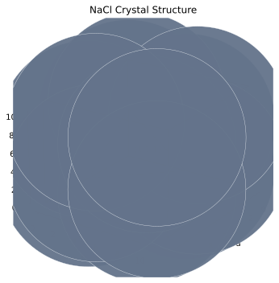

# 3D Crystal Visualization

PyTex now includes a VESTA-inspired 3D crystal viewer surface for unit cells, supercells, bond
overlays, repeated unit-cell overlays, bounded crystallographic plane overlays, and
crystallographic direction overlays.



## Scope

- unit-cell and repeated-supercell rendering
- atom glyphs with element-based color and radius scaling
- optional bond construction from covalent-radius heuristics
- lattice-edge rendering
- explicit repeated unit-cell overlays inside the displayed supercell
- optional pedagogical hexagonal-prism overlays for hexagonal-axis lattices
- bounded multiple-plane overlays with configurable colors, alpha, labels, and family-member
  offsets
- direction arrows with configurable colors, anchor points, and labels
- shared scientific Miller-label formatting for directions and planes, including negative-index
  bar notation
- optional slab or section filtering
- camera alignment by view direction or manual angles
- publication-oriented rendering through shared YAML styles

## Scientific Model

The viewer is built from the canonical PyTex structure model:

- atoms begin in fractional coordinates from `UnitCell`
- fractional coordinates are mapped through the direct basis into Cartesian crystal-space
  coordinates
- supercell repetition is explicit in direct-lattice units
- repeated unit-cell overlays are rendered from explicit direct-basis translations rather than
  inferred from screen-space repetition
- planes are computed from the Miller plane equation over the repeated-cell box and clipped to the
  displayed cell volume
- direction overlays are bounded to the repeated cell volume from an explicit fractional anchor
  point

The viewer does not invent its own crystallography. It renders geometry already defined by the
`Phase`, `Lattice`, and `UnitCell`.

## Example

```python
import numpy as np

from pytex import (
    CrystalCellOverlay,
    CrystalDirection,
    CrystalDirectionOverlay,
    CrystalPlane,
    CrystalPlaneOverlay,
    DirectionAnnotationStyle,
    FrameDomain,
    Handedness,
    MillerIndex,
    PlaneAnnotationStyle,
    ReferenceFrame,
    build_crystal_scene,
    get_phase_fixture,
    plot_crystal_structure_3d,
)

crystal = ReferenceFrame("crystal", FrameDomain.CRYSTAL, ("a", "b", "c"), Handedness.RIGHT)
phase = get_phase_fixture("diamond").load_phase(crystal_frame=crystal)

scene = build_crystal_scene(
    phase,
    repeats=(2, 2, 2),
    show_unit_cells=True,
    cell_overlays=(
        CrystalCellOverlay(
            kind="parallelepiped",
            anchor_fractional=np.array([0.0, 0.0, 0.0]),
            color="#94a3b8",
            alpha=0.8,
        ),
    ),
    plane_overlays=(
        CrystalPlaneOverlay(
            plane=CrystalPlane(MillerIndex([1, 1, 1], phase=phase), phase=phase),
            label_indices=(1, 1, 1),
            color="#dc2626",
            alpha=0.22,
            annotation_style=PlaneAnnotationStyle(fontsize=11.0),
        ),
    ),
    direction_overlays=(
        CrystalDirectionOverlay(
            direction=CrystalDirection(np.array([1.0, 1.0, 0.0]), phase=phase),
            anchor_fractional=np.array([0.0, 0.0, 0.0]),
            label_indices=(1, 1, 0),
            color="#2563eb",
            annotation_style=DirectionAnnotationStyle(fontsize=11.0),
        ),
    ),
    theme="presentation",
)
figure = plot_crystal_structure_3d(
    scene,
    view_direction=CrystalDirection(np.array([1.0, 1.0, 0.0]), phase=phase),
)
figure.savefig("diamond_structure.png", dpi=220)
```

## Interpretation Notes

- `build_crystal_scene(...)` computes reusable scene geometry and can be inspected separately from
  rendering.
- `plot_crystal_structure_3d(...)` renders either a `Phase` directly or a precomputed
  `CrystalScene`.
- The immediate teaching path now favors pinned in-repo fixtures such as `diamond` and `zr_hcp`
  so notebook and workflow examples line up with the validation corpus.
- `show_unit_cells=True` overlays the conventional direct-basis cell for every repeated lattice
  translation in the scene.
- `CrystalCellOverlay(kind="hexagonal_prism", ...)` adds a teaching-oriented six-sided prism
  centered on a hexagonal lattice point and extruded along `c`.
- `CrystalPlaneOverlay` lets one scene carry multiple bounded Miller planes with explicit colors,
  alpha values, member offsets, and scientific labels.
- `CrystalDirectionOverlay` lets one scene carry multiple labeled direction arrows bounded to the
  repeated cell volume from explicit anchor points.
- Plane and direction labels use one shared Miller-notation formatter so graphics across the
  library stay consistent.

## Hexagonal Prism Overlay

For hexagonal-axis lattices with `a=b`, `alpha=beta=90 deg`, and `gamma=120 deg`, PyTex can render
a six-sided prism around a lattice-point anchor. The basal vertices are constructed from the
direct-basis vectors

- `+a`
- `+b`
- `+(a+b)`
- `-a`
- `-b`
- `-(a+b)`

sorted around the basal-plane normal and then extruded by integer multiples of `c`.

This overlay is intentionally pedagogical. It shows the visually familiar hexagonal envelope of the
lattice, but it is not the canonical cell object used by the PyTex data model. The canonical
crystallographic semantics remain the direct-basis unit cell stored in `Lattice` and `UnitCell`.

## Current Limits

- the current bond model is heuristic, not chemistry-complete
- the hexagonal prism overlay is a visualization aid, not a primitive-cell or volume-equivalent
  conventional-cell replacement
- slicing is currently a simple slab filter rather than a full interactive clipping engine
- the current 3D backend is Matplotlib-based and optimized for static publication-oriented views
  rather than interactive scene editing

## Related Material

- {doc}`../concepts/technical_glossary_and_symbols`
- {doc}`style_customization`
- {doc}`combined_structure_diffraction_visualization`
- {doc}`../tutorials/notebooks/13_crystal_visualization_workflows`
- [../../tex/theory/crystal_visualization_geometry.tex](../../tex/theory/crystal_visualization_geometry.tex)

## References

### Normative

- `../../standards/reference_canon.md`
- `../../standards/notation_and_conventions.md`

### Informative

- `../../testing/plotting_validation_matrix.md`
