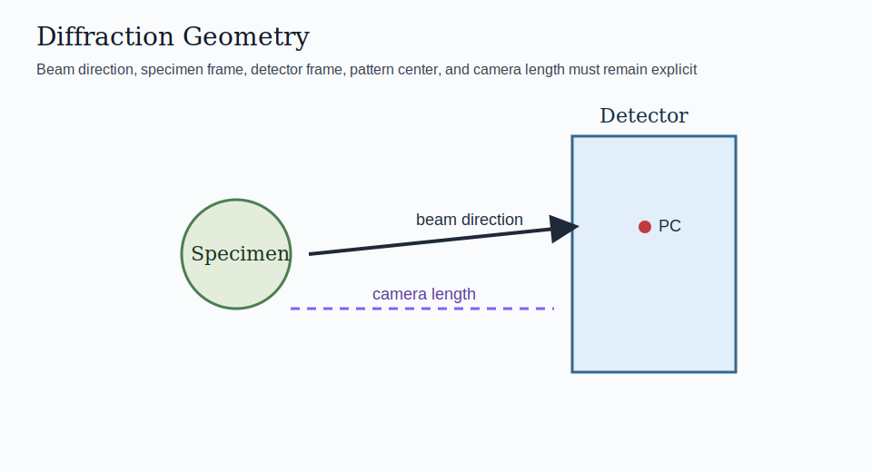

# Diffraction: Geometry And Bragg Rings

PyTex now includes the first real Phase 4 diffraction foundation on top of the existing geometry containers: detector coordinates, outgoing directions, scattering vectors, `2θ`, azimuth, and Bragg ring prediction from `d` spacing.

## Scope

- detector coordinates in millimeters relative to the explicit pattern center
- outgoing ray directions in the laboratory frame
- scattering-vector evaluation
- `2θ` and azimuth at detector coordinates
- Bragg-angle and ring-radius prediction from `d` spacing or `CrystalPlane`



## Geometry Model

The current implementation keeps three surfaces explicit:

- the specimen frame, where the sample is interpreted
- the detector frame, where pixels and pattern coordinates live
- the laboratory frame, where beam direction and scattering directions are evaluated

The detector basis is constructed so that zero tilt aligns the detector normal with the beam direction. The current `tilt_degrees` tuple is then applied as an intrinsic detector-axis rotation in `(u, v, n)` order.

The `pattern_center` contract is intentionally strict:

- `pattern_center[0]` and `pattern_center[1]` are normalized detector coordinates and must lie in `[0, 1]`
- `pattern_center[2]` is the detector-distance style depth parameter and must be strictly positive
- detector rays that are parallel to, or point away from, the detector plane are treated as invalid projections and returned with `NaN` detector coordinates

## Example

```python
import numpy as np

from pytex import (
    CrystalPlane,
    DiffractionGeometry,
    DiffractionPattern,
    FrameDomain,
    Handedness,
    Lattice,
    MillerIndex,
    Phase,
    ReferenceFrame,
    SymmetrySpec,
)

crystal = ReferenceFrame("crystal", FrameDomain.CRYSTAL, ("a", "b", "c"), Handedness.RIGHT)
specimen = ReferenceFrame("specimen", FrameDomain.SPECIMEN, ("x", "y", "z"), Handedness.RIGHT)
detector = ReferenceFrame("detector", FrameDomain.DETECTOR, ("u", "v", "n"), Handedness.RIGHT)
lab = ReferenceFrame("lab", FrameDomain.LABORATORY, ("X", "Y", "Z"), Handedness.RIGHT)

geometry = DiffractionGeometry(
    detector_frame=detector,
    specimen_frame=specimen,
    laboratory_frame=lab,
    beam_energy_kev=200.0,
    camera_length_mm=150.0,
    pattern_center=np.array([0.5, 0.5, 0.7]),
    detector_pixel_size_um=(50.0, 50.0),
    detector_shape=(512, 512),
)

coordinates_px = np.array([[256.0, 256.0], [300.0, 256.0]])
two_theta = geometry.two_theta_rad(coordinates_px)
q_vectors = geometry.scattering_vectors_lab(coordinates_px)

lattice = Lattice(3.0, 3.0, 3.0, 90.0, 90.0, 90.0, crystal_frame=crystal)
phase = Phase("demo", lattice=lattice, symmetry=SymmetrySpec.identity(reference_frame=crystal), crystal_frame=crystal)
plane = CrystalPlane(miller=MillerIndex(np.array([2, 0, 0]), phase=phase), phase=phase)
ring_radius_mm = geometry.ring_radius_mm_for_plane(plane)
```

## Interpretation Notes

- `2θ` is a detector-space angular observable derived from beam and outgoing directions
- the scattering vector is a reciprocal-space object and should not be confused with detector-plane offsets
- Bragg ring prediction in this foundation layer is geometric only; it does not yet include intensity modeling
- detector projection validity is separate from detector containment: a ray can intersect the detector plane but still fall outside the detector bounds

## Current Limits

- no calibrated detector-distortion or projector model yet
- no full kinematic pattern synthesis yet
- no stable interchange or adapter workflow yet

## Related Material

- `docs/architecture/diffraction_foundation.md`
- [../../tex/algorithms/diffraction_geometry_and_bragg_rings.tex](../../tex/algorithms/diffraction_geometry_and_bragg_rings.tex)
- [../../figures/diffraction_geometry.svg](../../figures/diffraction_geometry.svg)
