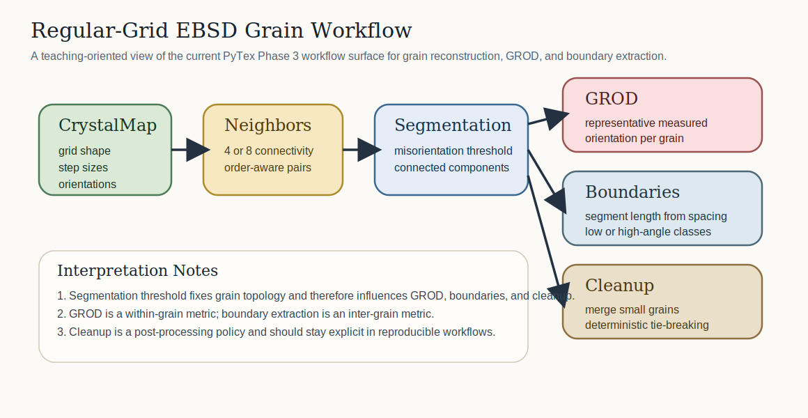

# EBSD: Grain Segmentation And GROD

PyTex includes a minimal but scientifically structured grain workflow for EBSD maps: thresholded
grain segmentation, grain reference orientation deviation (GROD), grain-boundary extraction, and
deterministic cleanup.

## Conceptual Flow

1. start from a `CrystalMap` with explicit map-frame and orientation semantics
2. build or infer a neighbor graph from the map geometry
3. segment grains by a misorientation threshold
4. choose a representative orientation within each grain
5. compute GROD relative to that representative orientation
6. extract boundary segments and optionally clean small grains



## What Is New In The Hardened Surface

- regular-grid and graph-backed coordinate modes share one adjacency substrate
- cross-phase neighbor pairs are never merged into the same grain
- grain-boundary extraction keeps topological edges explicit while respecting phase consistency
- majority smoothing remains available as a deterministic regular-grid label operation

## Example

```python
segmentation = crystal_map.segment_grains(
    max_misorientation_deg=5.0,
    symmetry_aware=True,
    connectivity=4,
)

grod = segmentation.grod_map_deg()
boundaries = segmentation.boundary_network(high_angle_threshold_deg=15.0)
cleaned = segmentation.merge_small_grains(min_size=4, until_stable=True)
```

## Interpretation Notes

- GROD remains defined relative to a representative measured orientation
- graph-backed segmentation is geometric, not confidence-weighted
- multiphase maps preserve adjacency but do not permit cross-phase unions

## Related Material

- {doc}`ebsd_import_normalization`
- {doc}`ebsd_kam`
- [../../tex/algorithms/ebsd_grain_segmentation_and_grod.tex](../../tex/algorithms/ebsd_grain_segmentation_and_grod.tex)
- [../../tex/algorithms/ebsd_boundaries_and_cleanup.tex](../../tex/algorithms/ebsd_boundaries_and_cleanup.tex)
- [../../tex/algorithms/multiphase_ebsd_graph_workflows.tex](../../tex/algorithms/multiphase_ebsd_graph_workflows.tex)
