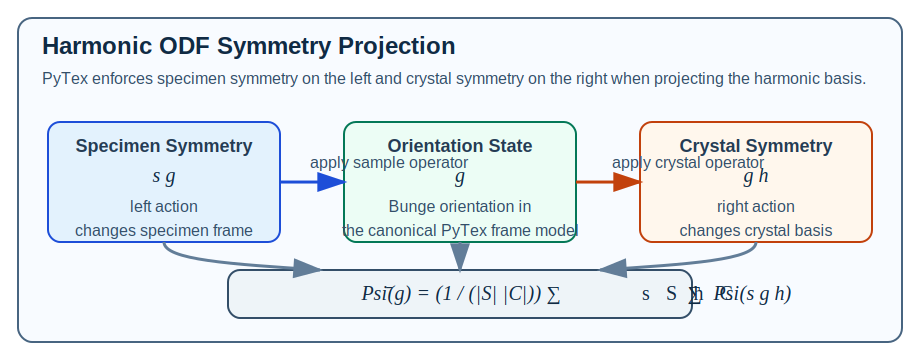

# Harmonic ODF Reconstruction

PyTex now provides a band-limited harmonic ODF reconstruction surface built on the same
explicit frame, phase, symmetry, and `PoleFigure` semantics used elsewhere in the repo.

Primary entry points:

- `HarmonicODF`
- `HarmonicODF.invert_pole_figures(...)`
- `HarmonicODF.evaluate(...)`
- `HarmonicODF.evaluate_pole_density(...)`
- `HarmonicODFReconstructionReport`
- `plot_odf(..., kind="sections")`

## Mathematical Model

Randle and Engler describe the classical series-expansion route as an ODF written in
symmetrized generalized spherical harmonics `T_l^{mu nu}(g)` with pole figures expanded in
matching harmonics and linked by a linear coefficient relation
(`references/Introduction_to_Texture_Analysis__Macrotexture_Microtexture_and_Orientation_Mapping.pdf`,
pp. 105-107).

PyTex implements that idea as a real, truncated basis on `SO(3)`:

```text
f(g) ~= sum_alpha c_alpha Psi_alpha(g)
```

where the unsymmetrized building blocks are real and imaginary parts of Wigner `D`
functions in Bunge Euler angles:

```text
D^l_mn(phi1, Phi, phi2) = exp(-i m phi1) d^l_mn(Phi) exp(-i n phi2)
```

PyTex keeps the source-preferred Bunge ordering:

```text
(phi1, Phi, phi2)
```

and evaluates the real basis through:

```text
Re(D^l_mn) = d^l_mn(Phi) cos(m phi1 + n phi2)
Im(D^l_mn) = d^l_mn(Phi) sin(m phi1 + n phi2)
```

## How Symmetry Is Handled

The ODF must satisfy the invariance relations

```text
f(g h) = f(g)   for crystal symmetry h in C
f(s g) = f(g)   for specimen symmetry s in S
```

PyTex enforces those relations numerically by group averaging each raw basis function:

```text
Psi_bar(g) = (1 / (|S| |C|)) sum_{s in S} sum_{h in C} Psi(s g h)
```

This is the crucial left/right distinction:

- crystal symmetry acts on the right because it changes the crystal basis
- specimen symmetry acts on the left because it changes the specimen frame

The implementation uses the repository `SymmetrySpec` operators directly, so harmonic ODFs
do not invent a private symmetry model.



## How The Inversion Is Solved

Randle and Engler also note two practical issues with harmonic reconstruction
(`references/Introduction_to_Texture_Analysis__Macrotexture_Microtexture_and_Orientation_Mapping.pdf`,
pp. 105-107):

- the expansion must be truncated at a finite `l_max`
- diffraction pole figures do not determine odd terms under antipodal measurement, which is
  part of the classical ghost problem

PyTex handles this as follows:

1. Build a full Bunge quadrature grid over `SO(3)` with Haar weights proportional to
   `sin(Phi)`.
2. Evaluate the symmetry-projected raw basis on that grid.
3. Orthonormalize the projected basis numerically with the weighted Gram matrix.
4. Build the PF forward operator against the current PyTex pole-density semantics:

   ```text
   I_m ~= sum_q w_q f(g_q) A_mq
   ```

   with

   ```text
   A_mq = (1 / |H|) sum_{u in H} K(angle(y_m, g_q u))
   ```

   where `H` is the crystal pole family and `K` is the configured pole-density kernel.
5. Solve the band-limited coefficient system by Tikhonov-regularized least squares.

This is a deliberate implementation choice. PyTex reconstructs a harmonic ODF, but it
couples that basis to the existing measured-direction `PoleFigure` model through the
current regularized forward operator rather than introducing a second disconnected PF data
surface.

## Even-Degree Handling

If all input pole figures are antipodal, PyTex defaults to `even_degrees_only=True`.

That matches the standard diffraction-texture limitation: antipodal PFs do not determine
odd harmonic orders uniquely. Users can override this behavior, but the default is chosen
to be physically and mathematically conservative.

## Example

```python
from pytex import (
    CrystalPlane,
    HarmonicODF,
    KernelSpec,
    MillerIndex,
    SymmetrySpec,
    plot_odf,
)

sample_symmetry = SymmetrySpec.from_point_group("mmm", reference_frame=specimen)

pole_figures = [
    load_xrdml_pole_figure("measurements/pf_100.xrdml", pole=pole_100, specimen_frame=specimen),
    load_xrdml_pole_figure("measurements/pf_110.xrdml", pole=pole_110, specimen_frame=specimen),
    load_xrdml_pole_figure("measurements/pf_111.xrdml", pole=pole_111, specimen_frame=specimen),
]

report = HarmonicODF.invert_pole_figures(
    pole_figures,
    degree_bandlimit=6,
    regularization=1e-6,
    include_symmetry_family=True,
    specimen_symmetry=sample_symmetry,
    pole_kernel=KernelSpec(name="de_la_vallee_poussin", halfwidth_deg=7.5),
    phi1_step_deg=30.0,
    big_phi_step_deg=20.0,
    phi2_step_deg=30.0,
)

print(report.relative_residual_norm)
print(report.matrix_rank)
print(report.mean_density)

sections = plot_odf(
    report.odf,
    kind="sections",
    section_phi2_deg=(0.0, 15.0, 30.0, 45.0, 60.0, 75.0),
    section_phi1_steps=121,
    section_big_phi_steps=61,
)
```

## Practical Guidance

- Start with `degree_bandlimit=4` or `6` before pushing the expansion harder.
- Start with coarse quadrature such as `30 deg / 20 deg / 30 deg`, then refine only if the
  residual and section plots justify it.
- Provide `specimen_symmetry` explicitly for rolled-sheet, fiber, or other common sample
  symmetries instead of hoping the inversion will infer it from the data.
- Treat `mean_density`, `minimum_density`, and `maximum_density` in the reconstruction
  report as review signals. A truncated harmonic ODF can still show negative lobes even
  when the fit to the PF data is numerically good.

## Current Limits

- The current implementation is band-limited and quadrature-based, not an infinite-order
  closed-form harmonic engine.
- The forward operator is aligned with the present PyTex pole-density kernel semantics.
  It is not yet a fully instrument-corrected X-ray or neutron texture inversion doctrine.
- Degree selection, kernel choice, and quadrature density remain user-controlled scientific
  choices and should be documented in any published workflow.

## Related Material

- {doc}`texture_odf_inversion`
- {doc}`xrdml_texture_import`
- {doc}`../validation/automated_test_cases`
- [../../tex/algorithms/harmonic_odf_reconstruction.tex](../../tex/algorithms/harmonic_odf_reconstruction.tex)

## References

### Normative

- {doc}`../concepts/orientation_texture`
- {doc}`../concepts/technical_glossary_and_symbols`
- {doc}`../validation/mtex_parity_matrix`

### Informative

- `references/reference_index.md`
- `references/formulation_summary.md`
