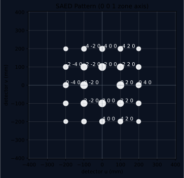

# SAED Generation

PyTex now includes a kinematic selected-area electron diffraction workflow built on explicit reciprocal-space and detector semantics.



## Scope

- reciprocal-lattice construction from `Phase`
- explicit `ZoneAxis` handling in crystal coordinates
- reflection filtering by zone condition
- detector-space projection through a camera-constant abstraction
- spot labeling and styling through the shared runtime plotting system

## Scientific Model

The current SAED workflow is a geometric and kinematic foundation:

1. enumerate candidate Miller indices
2. convert them into reciprocal-lattice vectors
3. apply the zone condition with the explicit direct-space zone axis
4. project in-zone reciprocal vectors into a detector basis orthogonal to the zone axis
5. assign a proxy intensity for ranking and plotting

The detector map is controlled by `camera_constant_mm_angstrom`, which acts as a simple camera-length style scale factor between reciprocal-length units and detector millimeters.

## Example

```python
import numpy as np

from pytex import (
    AtomicSite,
    Lattice,
    Phase,
    ReferenceFrame,
    SymmetrySpec,
    UnitCell,
    ZoneAxis,
    generate_saed_pattern,
    plot_saed_pattern,
)
from pytex.core.conventions import FrameDomain, Handedness

crystal = ReferenceFrame("crystal", FrameDomain.CRYSTAL, ("a", "b", "c"), Handedness.RIGHT)
lattice = Lattice(3.523, 3.523, 3.523, 90.0, 90.0, 90.0, crystal_frame=crystal)
unit_cell = UnitCell(lattice=lattice, sites=(AtomicSite("Ni1", "Ni", np.array([0.0, 0.0, 0.0])),))
phase = Phase(
    "Ni",
    lattice=lattice,
    symmetry=SymmetrySpec.from_point_group("m-3m", reference_frame=crystal),
    crystal_frame=crystal,
    unit_cell=unit_cell,
)

pattern = generate_saed_pattern(
    phase,
    ZoneAxis(indices=np.array([0, 0, 1]), phase=phase),
    camera_constant_mm_angstrom=180.0,
    max_index=5,
    max_g_inv_angstrom=3.0,
)
figure = plot_saed_pattern(pattern, theme="dark")
figure.savefig("ni_saed.png", dpi=200)
```

## Coordinate Semantics

The current SAED workflow keeps three coordinate meanings separate:

- crystal direct-space coordinates for the `ZoneAxis`
- reciprocal-space coordinates for reflection construction
- detector-plane coordinates in millimeters for plotting

This is important because zone-axis reasoning is defined in direct space, while diffraction spots live in reciprocal space and are finally rendered in detector coordinates.

`SAEDPattern` is the stable pattern-level container carrying the generated `SAEDSpot` collection, named detector and reciprocal frames, the camera constant, and the crystal-basis information used for the detector projection.

## Current Limits

- the current intensity is a proxy, not a dynamical diffraction model
- no Ewald-sphere curvature treatment for high-angle electron diffraction yet
- no adapter-backed diffsims comparison layer yet

## Related Material

- {doc}`../concepts/technical_glossary_and_symbols`
- {doc}`xrd_generation`
- {doc}`style_customization`
- [../../tex/algorithms/powder_xrd_and_saed.tex](../../tex/algorithms/powder_xrd_and_saed.tex)

## References

### Normative

- `../../standards/reference_canon.md`
- `../../standards/notation_and_conventions.md`

### Informative

- `../../testing/diffraction_validation_matrix.md`
