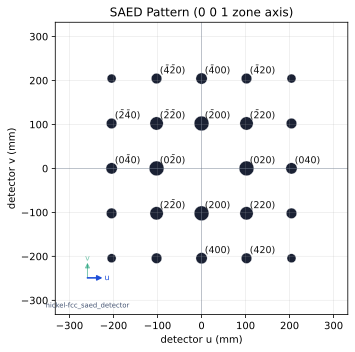

# SAED Generation

PyTex now includes a kinematic selected-area electron diffraction workflow built on explicit
reciprocal-space and detector semantics.



## Scope

- reciprocal-lattice construction from `Phase`
- explicit `ZoneAxis` handling in crystal coordinates
- reflection filtering by zone condition
- detector-space projection through a camera-constant abstraction
- spot labeling and styling through the shared runtime plotting system

## Scientific Model

The current SAED workflow is a geometric and kinematic foundation:

1. enumerate candidate Miller indices
2. convert them into reciprocal-lattice vectors
3. apply the zone condition with the explicit direct-space zone axis
4. project in-zone reciprocal vectors into a detector basis orthogonal to the zone axis
5. assign a proxy intensity for ranking and plotting

The detector map is controlled by `camera_constant_mm_angstrom`, which acts as a simple
camera-length style scale factor between reciprocal-length units and detector millimeters.

## Example

```python
import numpy as np

from pytex import (
    FrameDomain,
    Handedness,
    ReferenceFrame,
    ZoneAxis,
    generate_saed_pattern,
    get_phase_fixture,
    plot_saed_pattern,
)

crystal = ReferenceFrame("crystal", FrameDomain.CRYSTAL, ("a", "b", "c"), Handedness.RIGHT)
phase = get_phase_fixture("ni_fcc").load_phase(crystal_frame=crystal)

pattern = generate_saed_pattern(
    phase,
    ZoneAxis(indices=np.array([0, 0, 1]), phase=phase),
    camera_constant_mm_angstrom=180.0,
    max_index=5,
    max_g_inv_angstrom=3.0,
)
figure = plot_saed_pattern(pattern, theme="dark")
figure.savefig("ni_fcc_saed.png", dpi=200)
```

## Coordinate Semantics

The current SAED workflow keeps three coordinate meanings separate:

- crystal direct-space coordinates for the `ZoneAxis`
- reciprocal-space coordinates for reflection construction
- detector-plane coordinates in millimeters for plotting

This is important because zone-axis reasoning is defined in direct space, while diffraction spots
live in reciprocal space and are finally rendered in detector coordinates.

`SAEDPattern` is the stable pattern-level container carrying the generated `SAEDSpot` collection,
named detector and reciprocal frames, the camera constant, and the crystal-basis information used
for the detector projection.

The reciprocal frame's axes carry the IUCr star — `a*`, `b*`, `c*` — so a reciprocal-space vector
can never be mistaken for a direct-space one. The indices themselves are not starred: `(hkl)` are
already reciprocal-basis components, and the scattering vector is
$\mathbf{g}_{hkl} = h\mathbf{a}^{*} + k\mathbf{b}^{*} + l\mathbf{c}^{*}$.

### Stating The Frame In The Figure

Rather than relying on the axis labels alone, a pattern can carry its own detector-frame gizmo:

```python
plot_saed_pattern(pattern, show_frame_indicator=True)
```

The gizmo shows the in-plane `u` and `v` axes; the detector normal is omitted because it points at
the viewer. See {doc}`../architecture/reference_frame_foundation`.

The first pinned external-baseline case for this workflow now uses the built-in `ni_fcc` fixture
for a `[001]` zone-axis pattern and records shell geometry against a `diffsims` reference result
under `fixtures/diffraction/`.

## Forbidden Reflections And Double Diffraction

A kinematic pattern shows a real pattern's spots *minus* the ones that dynamical scattering puts
there. The largest such class is double diffraction. A beam diffracted by $\mathbf{g}_1$ is
itself an incident beam inside the crystal, so diffracting it again by $\mathbf{g}_2$ sends it
out along $\mathbf{g}_1 + \mathbf{g}_2$. A reflection whose structure factor vanishes therefore
appears anyway, as long as its indices are the algebraic sum of two reflections that are
themselves excited. Silicon $(002)$ along $[110]$ is the standard example, produced by
$(111) + (\bar{1}\bar{1}1)$.

The vectorized engine models the selection rule exactly, because the rule is geometric and does
not depend on the dynamical theory it cannot solve:

```python
from pytex.diffraction import KinematicSimulationConfig, simulate_zone_axis_spots

spots = simulate_zone_axis_spots(
    silicon,
    ZoneAxis(indices=np.array([1, 1, 0]), phase=silicon),
    config=KinematicSimulationConfig(include_double_diffraction=True),
)
forbidden = spots.forbidden_mask()
print(spots.double_diffraction_origin_label(int(forbidden.argmax())))
```

Such reflections are never mixed in unlabelled. `SpotTable.is_double_diffraction` marks them,
`double_diffraction_parents` records the strongest contributing pair, the exported reflection
table carries `double_diffraction` and `double_diffraction_origin` columns, and
`render_composite_saed` draws them hollow in a separate collection with its own legend entry.
Read the intensity as an observability estimate — `coupling * sum over paths of I1 * I2`, scaled
by `double_diffraction_coupling` — not as a kinematic intensity, since the kinematic intensity
of a forbidden reflection is exactly zero.

One consequence is worth stating because it is a common misreading: this can never revive a
**centring** absence. Centring conditions define a sublattice of reciprocal space, and a
sublattice is closed under addition, so the sum of two centring-allowed reflections is always
centring-allowed. Only **basis** absences — from a glide plane, a screw axis, or the motif — can
be revived, which is exactly what is observed.

The option is off by default; the legacy `generate_saed_pattern` does not implement it.

## Current Limits

- the current intensity is a proxy, not a dynamical diffraction model
- double diffraction supplies the correct set of extra spots, but their intensities are an
  indicative coupling estimate rather than a solved multi-beam calculation
- no Ewald-sphere curvature treatment for high-angle electron diffraction yet
- external-baseline coverage currently validates shell geometry for a pinned case rather than a
  broad orientation library

## Related Material

- {doc}`../concepts/technical_glossary_and_symbols`
- {doc}`phases_and_cif`
- {doc}`xrd_generation`
- {doc}`../tutorials/notebooks/12_saed_workflows`
- {doc}`style_customization`
- {doc}`/theory/powder_xrd_and_saed`

## References

### Normative

- `../../standards/reference_canon.md`
- `../../standards/notation_and_conventions.md`

### Informative

- `../../testing/diffraction_validation_matrix.md`
