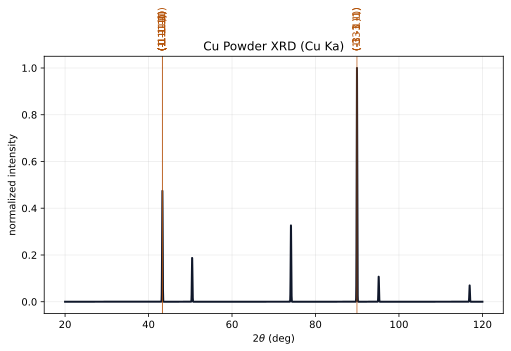

# Powder XRD Generation

PyTex now includes a structure-aware powder XRD workflow built on the same lattice, phase, and
reciprocal-space semantics used elsewhere in the library.



## Scope

- configurable wavelength through `RadiationSpec`
- reflection enumeration from the canonical lattice model
- `d`-spacing and `2\theta` computation from Bragg's law
- approximate intensity estimation from crystal structure and multiplicity
- optional Gaussian broadening into a continuous powder spectrum
- runtime plotting through the shared YAML style system

## Scientific Model

For a reflection with spacing \(d_{hkl}\) and wavelength \(\lambda\), PyTex applies Bragg's law

$$
2 d_{hkl} \sin \theta = \lambda,
$$

then reports the observable angle \(2\theta\). The current implementation computes

- the reciprocal-lattice vector magnitude \(||\mathbf{g}_{hkl}||\)
- \(d_{hkl} = 1 / ||\mathbf{g}_{hkl}||\)
- \(2\theta = 2 \arcsin(\lambda / 2d_{hkl})\)

The current intensity model is intentionally modest. It uses:

- multiplicity inferred from the phase point-group symmetry
- a simple x-ray structure-factor proxy based on atomic numbers and fractional coordinates
- a Lorentz-polarization factor

This is a useful foundational spectrum model, but it is not yet a fully calibrated
scattering-factor implementation.

## Example

```python
from pytex import (
    FrameDomain,
    Handedness,
    RadiationSpec,
    ReferenceFrame,
    generate_xrd_pattern,
    get_phase_fixture,
    plot_xrd_pattern,
)

crystal = ReferenceFrame("crystal", FrameDomain.CRYSTAL, ("a", "b", "c"), Handedness.RIGHT)
phase = get_phase_fixture("ni_fcc").load_phase(crystal_frame=crystal)

pattern = generate_xrd_pattern(
    phase,
    radiation=RadiationSpec.cu_ka(),
    two_theta_range_deg=(20.0, 120.0),
    resolution_deg=0.02,
    max_index=6,
    broadening_fwhm_deg=0.18,
)
figure = plot_xrd_pattern(pattern, theme="journal")
figure.savefig("ni_fcc_powder_xrd.png", dpi=200)
```

## Interpretation Notes

- `PowderReflection` is the reflection-level object carrying `d` spacing, `2\theta`,
  multiplicity, and intensity metadata.
- `PowderPattern` is the broadened spectrum object carrying the reflection list plus
  grid-sampled intensity.
- The current intensity surface is suitable for teaching, method prototyping, and
  structure-sensitive inspection, but it is not yet a full Rietveld-grade scattering engine.
- The first pinned external-baseline case for this workflow now uses the built-in `ni_fcc`
  fixture and a `pymatgen`-generated Cu Ka reference pattern recorded under
  `fixtures/diffraction/`.

## Current Limits

- no tabulated atomic form factors yet
- no preferred-orientation, absorption, or instrument-function model yet
- no profile families beyond the current Gaussian broadening path
- external-baseline coverage currently proves peak-position and multiplicity agreement for a small
  pinned case rather than a broad materials library

## Related Material

- {doc}`../concepts/technical_glossary_and_symbols`
- {doc}`phases_and_cif`
- {doc}`saed_generation`
- {doc}`../tutorials/notebooks/11_powder_xrd_workflows`
- {doc}`style_customization`
- [../../tex/algorithms/powder_xrd_and_saed.tex](../../tex/algorithms/powder_xrd_and_saed.tex)

## References

### Normative

- `../../standards/reference_canon.md`
- `../../standards/notation_and_conventions.md`

### Informative

- `../../testing/diffraction_validation_matrix.md`
