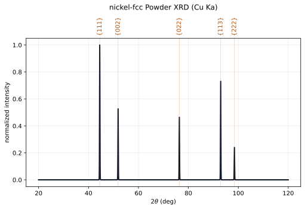

# Powder XRD Generation

PyTex now includes a structure-aware powder XRD workflow built on the same lattice, phase, and
reciprocal-space semantics used elsewhere in the library.



## Scope

- configurable wavelength through `RadiationSpec`
- reflection enumeration from the canonical lattice model
- $d$-spacing and $2\theta$ computation from Bragg's law
- approximate intensity estimation from crystal structure and multiplicity
- angle-dependent tabulated X-ray form factors or simpler teaching proxies
- Cu, Mo, Co, Cr and Fe radiation presets, including explicit Kα1/Kα2 doublets
- Gaussian or pseudo-Voigt broadening, constant or Caglioti angle-dependent width
- optional preferred-orientation correction through the shared diffraction model
- runtime plotting through the shared YAML style system
- a desktop/web workbench with indexed peak hover, canonical examples and live display controls

## Scientific Model

For a reflection with spacing $d_{hkl}$ and wavelength $\lambda$, PyTex applies Bragg's law

$$
2 d_{hkl} \sin \theta = \lambda,
$$

then reports the observable angle $2\theta$. The current implementation computes

- the reciprocal-lattice vector magnitude $||\mathbf{g}_{hkl}||$
- $d_{hkl} = 1 / ||\mathbf{g}_{hkl}||$
- $2\theta = 2 \arcsin(\lambda / 2d_{hkl})$

The default research-facing intensity model uses:

- multiplicity inferred from the phase point-group symmetry
- tabulated angle-dependent X-ray form factors, fractional coordinates, occupancy and isotropic
  displacement where supplied
- a Lorentz-polarization factor

The constant-atomic-number and unit-amplitude models remain explicit alternatives for teaching and
controlled comparisons. None of these is a calibrated instrument response.

## Example

```python
from pytex import (
    FrameDomain,
    Handedness,
    RadiationSpec,
    ReferenceFrame,
    generate_xrd_pattern,
    get_phase_fixture,
    plot_xrd_pattern,
)

crystal = ReferenceFrame("crystal", FrameDomain.CRYSTAL, ("a", "b", "c"), Handedness.RIGHT)
phase = get_phase_fixture("ni_fcc").load_phase(crystal_frame=crystal)

pattern = generate_xrd_pattern(
    phase,
    radiation=RadiationSpec.cu_ka(),
    two_theta_range_deg=(20.0, 120.0),
    resolution_deg=0.02,
    max_index=6,
    broadening_fwhm_deg=0.18,
)
figure = plot_xrd_pattern(pattern, theme="journal")
figure.savefig("ni_fcc_powder_xrd.png", dpi=200)
```

## Interpretation Notes

- `PowderReflection` is the reflection-level object carrying $d$ spacing, $2\theta$,
  multiplicity, and intensity metadata.
- `PowderPattern` is the broadened spectrum object carrying the reflection list plus
  grid-sampled intensity.
- The current intensity surface is suitable for indexing, teaching, method prototyping, and
  structure-sensitive inspection, but it is not a Rietveld-grade refinement engine.
- The first pinned external-baseline case for this workflow now uses the built-in `ni_fcc`
  fixture and a `pymatgen`-generated Cu Ka reference pattern recorded under
  `fixtures/diffraction/`.

## Current Limits

- no absorption, fluorescence, specimen-displacement or axial-divergence model
- no fitted background or detector response
- no crystallite-size/microstrain refinement (profile width is supplied, not inferred)
- external-baseline coverage currently proves peak-position and multiplicity agreement for a small
  pinned case rather than a broad materials library

## Workbench

Open **XRD** in either the desktop or web workbench. Scientific controls generate a new pattern;
the separate **Appearance** group redraws the existing arrays. Profile/stick colours, line width,
area fill, reflection labels, label threshold and vertical display transform therefore cannot
change the exported angles or intensities. Each visible reflection has a keyboard-focusable hover
target backed by the same row written to CSV and Excel.

The built-in nickel, silicon, Mo-on-nickel and alpha-zirconium cases make radiation, extinction,
doublet and crystal-metric behaviour testable without external files.

## Related Material

- {doc}`../concepts/technical_glossary_and_symbols`
- {doc}`phases_and_cif`
- {doc}`saed_generation`
- {doc}`../tutorials/notebooks/11_powder_xrd_workflows`
- {doc}`style_customization`
- {doc}`/theory/powder_xrd_and_saed`

## References

### Normative

- `../../standards/reference_canon.md`
- `../../standards/notation_and_conventions.md`

### Informative

- `../../testing/diffraction_validation_matrix.md`
